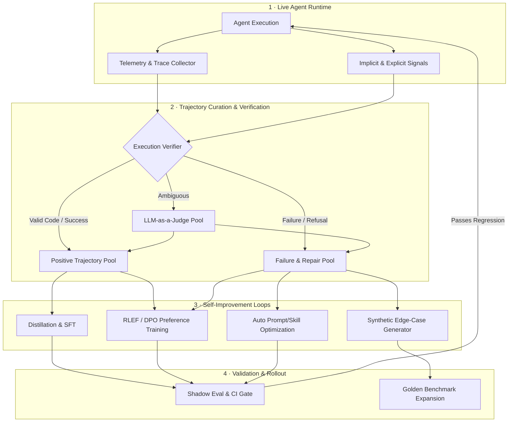
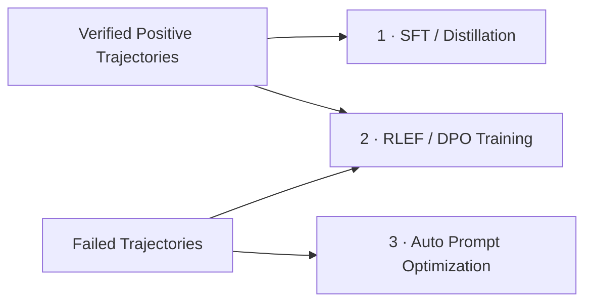
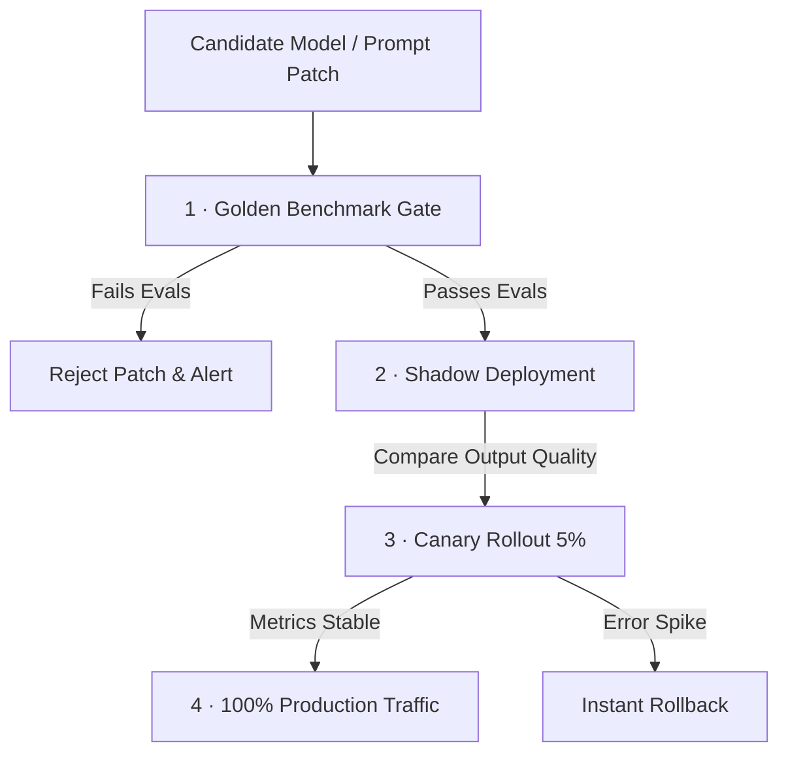

# Data Flywheel Systems

A static AI agent degrades as environments, APIs, and user inputs evolve. A **Data Flywheel System** creates a continuous, closed-loop pipeline that converts live production traces, execution feedback, and human interactions into improved models, automated prompt updates, and synthetic evaluation benchmarks.



---

## Prerequisites

- [Observability & Tracing](06-observability-and-tracing.md) — capturing step spans and payloads
- [Agent Evals](07-agent-evals.md) — outcome and trajectory scoring rubrics
- [Course 15 · Fine-Tuning & Custom Models](../advanced/module-15-fine-tuning-custom-models/index.md) — SFT and DPO fundamentals

---

## What You'll Learn

| Concept | Why it matters |
|---------|---------------|
| **Closed-loop Data Flywheel** | Turn operational agent telemetry into autonomous capability gains |
| **Execution Verifiers vs LLM Judges** | Filter noise using deterministic test outcomes over noisy LLM scores |
| **Trajectory Distillation (SFT)** | Transfer frontier model reasoning into faster, cheaper sub-models |
| **RLEF & Direct Preference Optimization** | Train models on execution rewards (e.g. unit test passes, terminal tool state) |
| **Automated Prompt & Skill Optimization** | Self-correct prompts and MCP tools using failing production traces |
| **Catastrophic Drift & Collateral Safeguards** | Prevent model collapse, data leakage, and silent capability degradation |

---

## Intuition: The Self-Correcting Engine

Consider a human software engineer fixing a bug:
1. They attempt a patch.
2. The unit test suite fails (execution feedback).
3. They analyze the error trace, adjust their mental model, and try again.
4. Once tests pass, the successful patch is committed to git (positive memory).

Standard LLM agents treat every request as an isolated state: if an agent fails a task, learns nothing from the mistake, and executes the exact same faulty tool call tomorrow, its intelligence is capped by its static pre-training weight cut-off and initial prompt.

A **Data Flywheel** provides the system memory and training loop: it records production attempts, verifies which paths actually succeeded, distills successful multi-turn reasoning paths into weights or prompts, and feeds failures into benchmark generators to ensure the agent never fails the same class of problem twice.

---

## Trajectory Capture & Trace Telemetry

To build a data flywheel, every agent turn must be captured as a structured execution trajectory $\mathcal{T}$:

\[
\mathcal{T} = \left( s_0, a_0, o_0, s_1, a_1, o_1, \dots, s_T, a_T, o_T \right)
\]

where $s_t$ is the conversation context state at step $t$, $a_t$ is the model action (thought + tool call), and $o_t$ is the environment observation (tool output/error).

### OpenInference Canonical Trace Schema

```python
import json
from dataclasses import dataclass, field
from typing import Any, Dict, List, Optional

@dataclass
class AgentStepTrace:
    step_index: int
    thought: str
    tool_name: Optional[str]
    tool_input: Dict[str, Any]
    tool_output: Any
    is_error: bool
    latency_ms: float
    token_cost_usd: float

@dataclass
class TrajectoryPayload:
    trajectory_id: str
    user_prompt: str
    steps: List[AgentStepTrace]
    final_output: str
    implicit_feedback: Dict[str, Any]  # e.g., {"user_accepted": True, "retry_count": 0}
    explicit_feedback: Optional[int]   # e.g., +1, -1, None
    metadata: Dict[str, Any] = field(default_factory=dict)

    def to_json(self) -> str:
        return json.dumps(self, default=lambda o: o.__dict__, indent=2)
```

---

## Data Filtering & Trajectory Verification

Not all production logs should enter the training dataset. Toxic inputs, low-quality attempts, incomplete tool executions, and hallucinated paths must be filtered.

```text
Production Traces (100%)
  │
  ├── 1. Privacy & PII Scrubbing (Regex + NER Masking) ──────────────► Drop Toxic/PII
  │
  ├── 2. Deterministic Execution Verification (Sandboxed Test/Linter) ─► Pass: Positive Pool
  │                                                                    Fail: Negative Pool
  │
  └── 3. LLM-as-a-Judge Evaluation (For Ambiguous Outcomes) ─────────► High Confidence: SFT Pool
                                                                       Low Confidence: Human Review
```

### Deterministic Execution Verifiers

For coding, SQL generation, workflow automation, and tool execution agents, deterministic verifiers provide ground-truth verification without LLM judge latency or bias:

```python
import subprocess
import tempfile

def verify_coding_trajectory(code_solution: str, test_suite: str) -> bool:
    """Run code solution inside an isolated execution environment."""
    with tempfile.NamedTemporaryFile(suffix=".py", mode="w") as f:
        full_script = f"{code_solution}\n\n{test_suite}"
        f.write(full_script)
        f.flush()
        
        try:
            res = subprocess.run(
                ["python3", f.name],
                capture_output=True,
                text=True,
                timeout=5
            )
            return res.returncode == 0
        except subprocess.TimeoutExpired:
            return False
```

---

## Continuous Self-Improvement Mechanisms

Once filtered into verified positive trajectories $\mathcal{D}_{pos}$ and failed trajectories $\mathcal{D}_{neg}$, three parallel self-improvement pipelines process the data:



### 1. Supervised Fine-Tuning (SFT) & Distillation

High-reward trajectories generated by frontier models (e.g. Claude 3.7 Sonnet) are converted into conversation turn formats to fine-tune compact, high-speed open models (e.g. Qwen 2.5 14B, Llama 3.3 70B):

```json
{
  "messages": [
    {"role": "system", "content": "You are an autonomous SQL agent."},
    {"role": "user", "content": "Get top 5 customers by revenue in 2025."},
    {"role": "assistant", "content": "I will execute the database query script.\n<tool_call>{\"name\": \"run_sql\", \"args\": {\"query\": \"SELECT customer_id, SUM(amount) FROM sales WHERE year=2025 GROUP BY customer_id ORDER BY 2 DESC LIMIT 5;\"}}</tool_call>"},
    {"role": "user", "content": "<tool_output>{\"rows\": [[102, 45000], [89, 41000]]}</tool_output>"},
    {"role": "assistant", "content": "The top customers in 2025 are customer #102 ($45,000) and customer #89 ($41,000)."}
  ]
}
```

### 2. Reinforcement Learning from Execution Feedback (RLEF / DPO)

When the agent attempts a task multiple times or when both a failed trajectory $\mathcal{T}_{chosen}$ (repaired) and $\mathcal{T}_{rejected}$ (failed) exist, we formulate a Direct Preference Optimization (DPO) objective:

\[
\mathcal{L}_{DPO}(\theta) = -\mathbb{E}_{(\mathcal{T}_w, \mathcal{T}_l) \sim \mathcal{D}} \left[ \log \sigma \left( \beta \log \frac{\pi_\theta(\mathcal{T}_w)}{\pi_{ref}(\mathcal{T}_w)} - \beta \log \frac{\pi_\theta(\mathcal{T}_l)}{\pi_{ref}(\mathcal{T}_l)} \right) \right]
\]

where $\mathcal{T}_w$ is the winning trajectory (tests passed, fewer steps) and $\mathcal{T}_l$ is the losing trajectory (tool error, syntax bug).

```python
def create_dpo_pair(failed_trace: Dict, repaired_trace: Dict) -> Dict:
    """Format choosing vs rejecting trajectory pairs for DPO loss."""
    return {
        "prompt": failed_trace["user_prompt"],
        "chosen": json.dumps(repaired_trace["steps"]),
        "rejected": json.dumps(failed_trace["steps"])
    }
```

### 3. Automated Prompt & Skill Optimization

Not every improvement requires retraining model weights. System prompts and tool instructions (MCP skills) can be evolved automatically using TextGrad or DSPy-style gradient descent over natural language feedback:

```python
def generate_prompt_patch(failing_traces: list[dict], current_system_prompt: str) -> str:
    """Generate system prompt improvement based on failure trace clusters."""
    prompt = f"""
    Current Agent System Prompt:
    {current_system_prompt}

    Recent Production Failure Traces:
    {json.dumps(failing_traces, indent=2)}

    Analyze the common failure mode in the trajectories above. 
    Output an updated, revised System Prompt that introduces explicit negative constraints 
    or operational rules to prevent these exact failure modes without degrading baseline functionality.
    """
    return llm.generate(prompt)
```

---

## Closed-Loop Architecture & Guardrails

Deploying fine-tuned models or self-optimized prompts back to production without continuous evaluation leads to **model collapse** and **catastrophic forgetting**.



### Production Guardrail Checklist

| Guardrail | Implementation | Purpose |
|-----------|----------------|---------|
| **PII / Secret Anonymization** | Presidio / Custom Regex | Prevent API keys, user passwords, and customer PII from leaking into SFT datasets |
| **Data De-duplication** | MinHash LSH / Semantic Vector Clustering | Prevent overfitting on highly repetitive production prompts |
| **Shadow Traffic Execution** | Async Event Bus (Kafka/SQS) | Evaluate fine-tuned candidate models side-by-side with production models on real live inputs |
| **Automated Rollback Trigger** | Prometheus Alertmanager | Revert system prompt or model endpoint if step error rate spikes > 2% |

---

## Edge Cases & Misconceptions

| Myth / Misconception | Reality in Production |
|----------------------|-----------------------|
| *"Fine-tuning on all production logs improves accuracy."* | Training on unverified, noisy logs causes **model collapse**; only 5-10% of high-reward, verified traces belong in SFT. |
| *"LLM judges are sufficient for dataset filtering."* | LLM judges drift and exhibit self-preference bias. Combine with **deterministic execution verifiers** (sandboxed execution, linter passes). |
| *"Data flywheels only apply to open-weights models."* | System prompts, RAG context selection rules, and MCP tool docstrings can be auto-optimized closed-loop for proprietary API models like Claude Sonnet. |
| *"Synthetic data can fully replace real traces."* | Synthetic data lacks real-world edge-case distributions, latency hiccups, and user typo noise present in live telemetry. |

---

## Key Takeaways

- A **Data Flywheel** converts live execution traces and user feedback into continuous agent self-improvement.
- **Trace schemas** must capture exact state steps, thoughts, tool inputs, observation results, and terminal outcomes.
- Use **deterministic verifiers** (sandbox code test passes, JSON schema validity) over LLM-as-a-judge whenever possible.
- **SFT Distillation** transfers frontier reasoning into fast sub-models; **RLEF/DPO** optimizes tool trajectory efficiency.
- Auto-optimize system prompts and MCP skills via failing trace analysis before resorting to model retraining.
- Always enforce **Shadow Deployments** and **Canary Rollouts** to prevent catastrophic regression in live agents.

---

## Related Reading & Resources

- [Observability & Tracing](06-observability-and-tracing.md)
- [Agent Evals](07-agent-evals.md)
- [Course 15 · Fine-Tuning & Custom Models](../advanced/module-15-fine-tuning-custom-models/index.md)
- [Case Study: Design an Agent Data Flywheel](../interview-prep/design-agent-data-flywheel.md)
