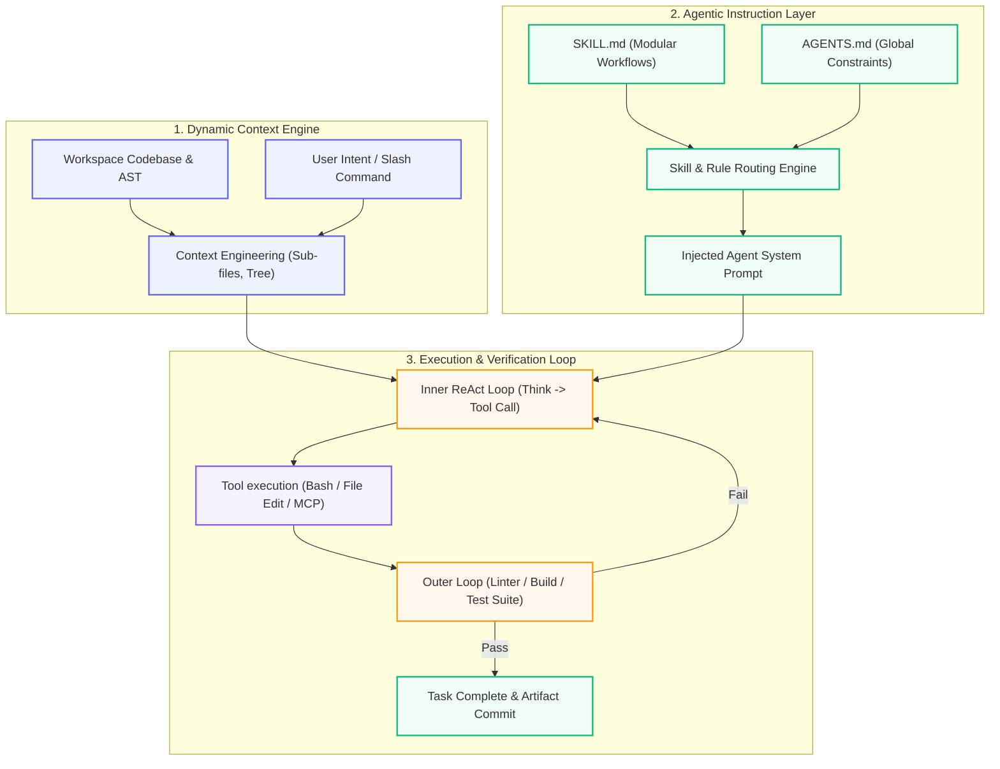

# ⚡ AI Engineering in 2026: IDE Agents & Modern Primitives

Master modern AI developer primitives: Claude Code, agent skills (`SKILL.md`), rule systems (`AGENTS.md`), loop engineering, and context window optimization.

  Track 03
  🔥 Modern AI (2026)
  ⏱️ 4 Core Modules

---

## 🏗️ 2026 IDE Agent Execution & Context Loop Architecture

---

## 📚 Practitioner Guides

| Topic | What You'll Learn | Page | Core Primitives |
|-------|-------------------|------|-----------------|
| ⚡ **Claude Code** | Agentic terminal coding, security permissions, autonomous workflows | [Claude Code](claude-code.md) | Terminal CLI, permission model, git tools |
| 🛠️ **Skills & Rules** | `SKILL.md`, `AGENTS.md`, Cursor skills, persistent custom instructions | [Skills & Rules](skills-and-rules.md) | YAML frontmatter, trigger matching, instructions |
| 🔄 **Loop Engineering** | Inner/outer loops, scheduled agents, harness execution cycles | [Loop Engineering](loop-engineering.md) | Subagent delegation, verification loops, timers |
| 🧠 **Context Engineering** | What goes in the window — the modern prompt engineering | [Context Engineering](context-engineering.md) | Window packing, AST reduction, dynamic truncation |

---

## 🧩 2026 Skills vs. Core Handbook Mapping

| 2026 Skill | Handbook Foundation |
|------------|---------------------|
| **Claude Code** | [Agent Engineering Track](../agent-engineering/index.md) → [Harness Engineering](../agent-engineering/04-harness-engineering.md) |
| **Skills & Rules Files** | [Course 11 · Prompt Engineering](../build/module-14-prompt-engineering-mastery/index.md) |
| **Loop Engineering** | [The Agent Loop](../agent-engineering/01-agent-loop.md), [Course 08 · Harness](../build/module-18-agent-harness-tools-runtime/index.md) |
| **Context Engineering** | [Course 02 · Tokens & Costs](../foundations/module-01-ai-engineering-essentials/lessons/03-tokens-and-costs.md), [Memory Systems](../agent-engineering/02-memory.md) |

---

👉 **Start Here:** [Claude Code & Terminal Agents](claude-code.md)

---

## 🎬 Recommended Free Videos & Demos

| Video / Tech Talk | Creator / Presenter | Focus Area | Direct Link |
|-------------------|---------------------|------------|-------------|
| **Claude Code & Agentic Workflows** | Anthropic | Official terminal agent walkthrough, permission model, and tools integration | [Search on YouTube →](https://www.youtube.com/results?search_query=Anthropic+Claude+Code+%26+Agentic+Workflows) |
| **Aider & Repository Context Engineering** | Paul Gauthier (Aider) | Repository maps using tree-sitter, git diff management, and context packing | [Search on YouTube →](https://www.youtube.com/results?search_query=Paul+Gauthier+%28Aider%29+Aider+%26+Repository+Context+Engineering) |
| **Model Context Protocol (MCP) Live Specification** | Anthropic | Live demonstration of MCP client/server protocol, tool discovery, and custom servers | [Search on YouTube →](https://www.youtube.com/results?search_query=Anthropic+Model+Context+Protocol+MCP+Live+Specification) |

