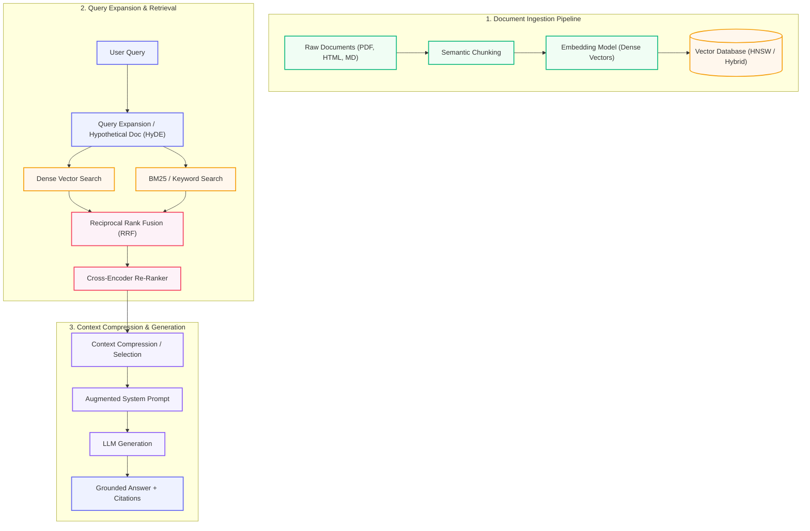

# 06. RAG: Retrieval-Augmented Generation

Master RAG systems from fundamental chunking and embeddings to hybrid vector-sparse search, re-ranking, graph RAG, and production evaluation.

  Course 06
  ⚡ Intermediate → Advanced
  ⏱️ 11 lessons · ~18h

---

## 🏗️ Enterprise Modular RAG Pipeline Architecture

---

## 📚 Course Lessons

| # | Lesson Title | Duration | Level | Core Concept |
|---|--------------|----------|-------|--------------|
| 1 | [Introduction to RAG Systems](lessons/01-introduction-to-rag.md) | 50 min | 🟢 Beginner | Retrieve-then-generate paradigm, parametric vs non-parametric memory |
| 2 | [Vector Databases & Embeddings](lessons/02-vector-databases.md) | 55 min | ⚡ Intermediate | Embedding spaces, distance metrics (Cosine, L2, Inner Product) |
| 3 | [Chunking Strategies](lessons/03-chunking-strategies.md) | 50 min | ⚡ Intermediate | Fixed-size, sentence, semantic, hierarchical chunking |
| 4 | [Retrieval Methods](lessons/04-Retrieval-Methods.md) | 55 min | ⚡ Intermediate | Dense retrieval, sparse keyword search, metadata filtering |
| 5 | [Building a Basic RAG System](lessons/05-Building-a-Basic-RAG-System.md) | 60 min | ⚡ Intermediate | End-to-end Python script with Chroma/FAISS and OpenAI/Anthropic |
| 6 | [Advanced RAG Techniques](lessons/06-Advanced-RAG-Techniques.md) | 55 min | 🔥 Advanced | Parent-document retrieval, sentence window retrieval, HyDE |
| 7 | [Hybrid Search](lessons/07-Hybrid-Search.md) | 50 min | ⚡ Intermediate | Combining BM25 sparse + Dense vector search via Reciprocal Rank Fusion |
| 8 | [RAG Evaluation Metrics](lessons/08-RAG-Evaluation-Metrics.md) | 55 min | 🔥 Advanced | Ragas triad: Faithfulness, Answer Relevance, Context Precision |
| 9 | [Agentic RAG](lessons/09-Agentic-RAG.md) | 60 min | 🔥 Advanced | Self-RAG, Corrective RAG (CRAG), dynamic query routing |
| 10 | [RAG in Production](lessons/10-RAG-in-Production.md) | 65 min | 🔥 Advanced | Caching, streaming, multi-tenancy, rate limits, latency optimization |
| 11 | [Graph RAG and Knowledge Graphs](lessons/11-graph-rag-and-knowledge-graphs.md) | 60 min | 🔥 Advanced | Entity extraction, knowledge graph indexing, hybrid Graph+Vector RAG |

---

👉 **Get Started:** [Lesson 01 · Introduction to RAG Systems](lessons/01-introduction-to-rag.md)
