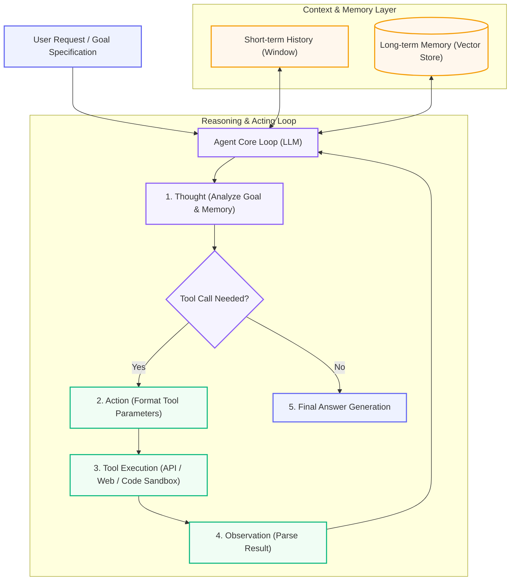

# 07. AI Agents Fundamentals

Master AI agents from ground zero: reasoning loops (ReAct), tool integration, memory architectures, multi-step planning, state management, and modern agent frameworks.

  Course 07
  ⚡ Intermediate → Advanced
  ⏱️ 10 lessons · ~16h

---

## 🤖 Cognitive Agent Execution Loop Architecture

---

## 📚 Course Lessons

| # | Lesson Title | Duration | Level | Core Concept |
|---|--------------|----------|-------|--------------|
| 1 | [Introduction to AI Agents](lessons/01-Introduction-to-Agents.md) | 60 min | ⚡ Intermediate | Definition, agent vs workflow, autonomy spectrum |
| 2 | [Agent Architectures](lessons/02-Agent-Architectures.md) | 60 min | 🔥 Advanced | ReAct, Plan-and-Solve, Reflection, LATS (Language Agent Tree Search) |
| 3 | [The ReAct Pattern — Reasoning & Acting](lessons/03-ReAct-Pattern.md) | 65 min | 🔥 Advanced | Deconstructing Thought-Action-Observation loops step-by-step |
| 4 | [Tool Use & Function Calling](lessons/04-Tool-Use.md) | 60 min | 🔥 Advanced | Schema design, tool parameter validation, handling execution errors |
| 5 | [Agent Memory Systems](lessons/05-Agent-Memory.md) | 60 min | 🔥 Advanced | Short-term conversation buffer, semantic long-term memory, procedural memory |
| 6 | [Planning & Reasoning](lessons/06-Planning-and-Reasoning.md) | 35 min | 🔥 Advanced | Task decomposition, sub-goal generation, self-correction |
| 7 | [Building an Agent from Scratch](lessons/07-Building-an-Agent.md) | 45 min | 🔥 Advanced | Pure Python zero-dependency ReAct agent implementation |
| 8 | [Agent Frameworks (LangGraph, CrewAI)](lessons/08-Agent-Frameworks.md) | 35 min | 🔥 Advanced | State graphs, persistence, streaming, multi-agent frameworks |
| 9 | [Agent Types & Patterns](lessons/09-Agent-Types.md) | 35 min | 🔥 Advanced | Research agents, coding agents, customer support agents |
| 10 | [Workflow vs Agent Design](lessons/10-Workflow-vs-Agent.md) | 35 min | 🔥 Advanced | Deterministic DAG vs autonomous agent decision matrix |

---

👉 **Get Started:** [Lesson 01 · Introduction to AI Agents](lessons/01-Introduction-to-Agents.md)
