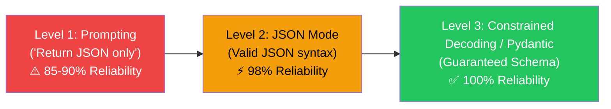

# Structured Outputs and Pydantic Validation

## What You'll Learn

| Objective | Outcome |
|-----------|---------|
| Compare raw prompt extraction vs JSON Mode vs Structured Outputs | Choose the right reliability level for your application |
| Define schemas using Pydantic models in Python | Enforce type constraints, enums, and required fields |
| Handle validation errors and retry loops | Ensure 100% compliant data extraction pipelines |

---

## The Problem: Non-Deterministic Text Extraction

Unstructured text outputs from LLMs break backend APIs. If an application expects a JSON payload:

```json
{"user_id": 104, "score": 0.85, "tags": ["verified", "active"]}
```

A raw LLM might return Markdown code fences, missing double quotes, or trailing commas that break `json.loads()`.

---

## 3 Levels of Structural Reliability



---

## Python Implementation with Pydantic & OpenAI

```python
from pydantic import BaseModel, Field
from typing import List, Optional
from openai import OpenAI

client = OpenAI()

# 1. Define target Pydantic schema
class UserExtraction(BaseModel):
    name: str = Field(description="Full name of the user")
    email: str = Field(description="Primary email address")
    age: Optional[int] = Field(description="Age in years if available")
    interests: List[str] = Field(default_factory=list, description="List of mentioned interests")

# 2. Call LLM with parse() (Guaranteed Structured Output)
def extract_user_info(unstructured_text: str) -> UserExtraction:
    completion = client.beta.chat.completions.parse(
        model="gpt-4o-mini",
        messages=[
            {"role": "system", "content": "Extract structured user information from text."},
            {"role": "user", "content": unstructured_text},
        ],
        response_format=UserExtraction,
    )
    return completion.choices[0].message.parsed

# Example Usage:
text = "Contact Alex Rivers (alex.rivers@example.com), 29 years old. Passionate about machine learning and cloud architecture."
result = extract_user_info(text)

print(f"Name: {result.name}")
print(f"Email: {result.email}")
print(f"Interests: {result.interests}")
```

---

## Robust Fallback Validation Loop

If an API does not support constrained decoding, use a Pydantic retry validation loop:

```python
from pydantic import ValidationError

def extract_with_retry(prompt: str, schema_class: type[BaseModel], max_retries: int = 3):
    messages = [{"role": "user", "content": prompt}]
    
    for attempt in range(max_retries):
        response = client.chat.completions.create(
            model="gpt-4o-mini",
            messages=messages,
            response_format={"type": "json_object"},
        )
        raw_json = response.choices[0].message.content
        
        try:
            return schema_class.model_validate_json(raw_json)
        except ValidationError as err:
            # Feedback error back to LLM for self-correction
            messages.append({"role": "assistant", "content": raw_json})
            messages.append({
                "role": "user",
                "content": f"JSON failed validation: {err}. Please return corrected JSON matching schema."
            })

    raise ValueError("Failed to extract valid JSON after maximum retries.")
```

---


!!! note "Key Intuition & Mental Model"
    When building production AI systems, isolate model calls behind clean abstraction interfaces. Always design for fallback models, rate limit retries, and strict schema validation.


## Key Takeaways

- Raw text prompting for JSON is brittle in production environments.
- OpenAI Structured Outputs and Pydantic enforce 100% type-safe JSON extraction.
- Always include field descriptions in Pydantic models—the LLM uses them as instructions!


## Further Reading & Primary References

1. [Attention Is All You Need (Vaswani et al. 2017)](https://arxiv.org/abs/1706.03762)
2. [Retrieval-Augmented Generation for Knowledge-Intensive NLP Tasks (Lewis et al. 2020)](https://arxiv.org/abs/2005.11401)
3. [ReAct: Synergizing Reasoning and Acting in Language Models (Yao et al. 2022)](https://arxiv.org/abs/2210.03629)
