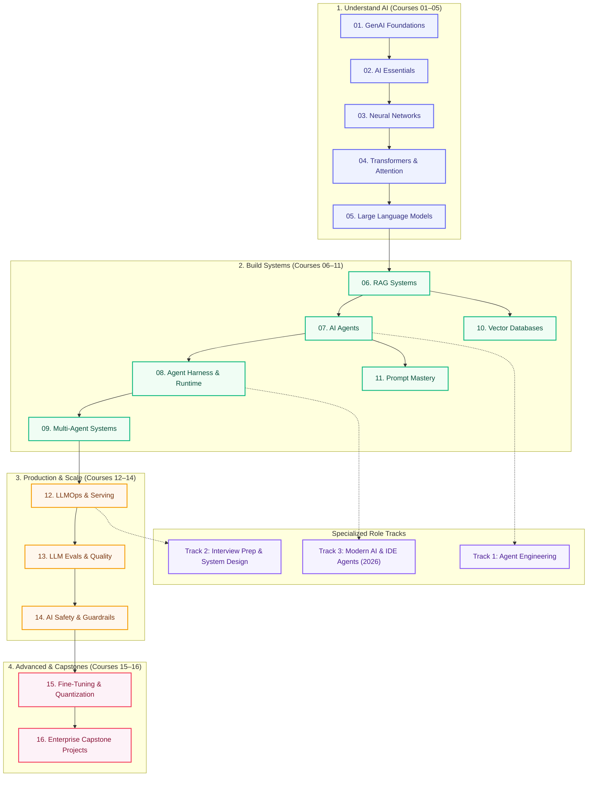

# AI Engineering Hub

  
✨ The Go-To Open-Source AI Engineering Hub

  
The All-in-One Destination for AI Learning, Labs, Resources &amp; Interview Prep

  
One unified open-source platform. From PyTorch &amp; Transformer math to Hybrid RAG, Autonomous AI Agents, System Design Interviews, and Production LLMOps. 100% Free. Real production code.

  

    <a class="hero__btn hero__btn--primary" href="start-here/">⚡ Start Here</a>
    <a class="hero__btn hero__btn--secondary" href="learn/">📚 Browse 16 Courses</a>
    <a class="hero__btn hero__btn--github" href="https://github.com/psssnikhil/ai-engineering-hub">★ Star on GitHub</a>
  

  

    🤖 IDE AI Tutor Prompts:
    "Where should I start?"
    "Explain scaled dot-product attention"
    "Mock interview: RAG system design"
    "Review my agent loop"
  

  16 Core Courses
  140+ Lessons
  3 Specialized Tracks
  30+ Executable Labs
  100% Open Source

---

## 🌟 The 5 Pillars: Everything You Need in One Hub

Why look across dozens of scattered blogs, paid bootcamps, and disconnected repos? This repository unifies the complete AI engineering stack:

  

    
📚

    
1. Complete Learning Path

    
16 sequential, deep-dive courses from tokenization math &amp; attention to LoRA fine-tuning, vLLM serving, and enterprise capstones.

    <a class="persona-card__cta" href="learn/">Explore 16 Courses →</a>
  

  

    
🛠️

    
2. Executable Labs &amp; Projects

    
30+ hands-on Python labs and 10 portfolio projects with starter code and verified solutions: Doc Q&amp;A, Tool Agents, Hybrid Vector Search, and Guardrails.

    <a class="persona-card__cta" href="projects/build-these/">Build Projects →</a>
  

  

    
💼

    
3. Interview Prep &amp; System Design

    
Land Senior AI roles with 10 full 45-minute whiteboard case studies (RAG, Agent Platforms, LLM Serving) and 50+ detailed technical question banks.

    <a class="persona-card__cta" href="interview-prep/">Interview Track →</a>
  

  

    
📖

    
4. Curated Papers &amp; Resources

    
Seminal research papers, open-source repositories, free video masterclasses, and topic deep dives organized by domain.

    <a class="persona-card__cta" href="resources/">Curated Resources →</a>
  

  

    
🤖

    
5. Interactive Socratic IDE Tutoring

    
Clone the repo and pair-program in your IDE (Claude Code, Cursor, Antigravity) using built-in AI tutor skills and automated lab verifiers.

    <a class="persona-card__cta" href="ai-engineering-2026/">Modern AI (2026) →</a>
  

---

## 🗺️ Curriculum Architecture

---

## 🎯 Who is this for?

  

    
🌱

    
New to AI

    
Software engineer or student starting from ground zero with Python and LLMs.

    <a class="persona-card__cta" href="start-here/">Start Here →</a>
  

  

    
🧠

    
Know ML, need LLMs

    
ML practitioner catching up on modern transformers, APIs, vector DBs, and fine-tuning.

    <a class="persona-card__cta" href="learn/">Browse Curriculum →</a>
  

  

    
🤖

    
Building AI Agents

    
Engineer shipping autonomous agent loops, tools, MCP, and multi-agent systems.

    <a class="persona-card__cta" href="agent-engineering/">Agent Track →</a>
  

  

    
⚡

    
IDE &amp; Coding Agents

    
Mastering Claude Code, Cursor skills, execution loops, and context engineering.

    <a class="persona-card__cta" href="ai-engineering-2026/">Modern AI (2026) →</a>
  

  

    
🛡️

    
Shipping to Production

    
Architecting LLMOps, automated evals, continuous monitoring, and security guardrails.

    <a class="persona-card__cta" href="production/module-10-llmops-production-systems/">Production Track →</a>
  

---

## 🧭 Navigation & Shortcuts

  <a class="quick-nav__item" href="start-here/">🚀 Start Here</a>
  <a class="quick-nav__item" href="learn/">📚 Learn Courses</a>
  <a class="quick-nav__item" href="learn/study-plans/">⏱️ Study Plans</a>
  <a class="quick-nav__item" href="projects/build-these/">🛠️ Build Projects</a>
  <a class="quick-nav__item" href="topic-map/">🗺️ Topic Map</a>
  <a class="quick-nav__item" href="faq/">💡 FAQ</a>
  <a class="quick-nav__item" href="getting-started/">⚙️ Setup</a>

| Goal | Destination |
|------|-------------|
| **Follow the curriculum** | **[Learn](learn/index.md)** — 16 courses in order |
| **New here** | [Start Here](start-here.md) |
| **Week-by-week schedule** | [Study Plans](learn/study-plans.md) |
| **Build a portfolio** | [Build These First](projects/build-these.md) |
| **Find any topic** | [Topic Map](topic-map.md) |
| **Questions** | [FAQ](faq.md) |

---

## ⚡ The Learning Roadmap

| Stage | Courses | Core Topics Covered |
|-------|---------|--------------------|
| **1. Understand AI** | 01–05 | NLP → neural nets → transformers → attention → LLM architecture |
| **2. Build Applications** | 06–11 | Modular RAG, autonomous agents, tool runtime, multi-agent systems, vector DBs, prompts |
| **3. Production & Ops** | 12–14 | Serving, vLLM/Ollama, LLMOps, automated evals, safety & guardrail gateways |
| **4. Advanced** | 15–16 | Fine-tuning (LoRA/QLoRA), quantization, enterprise capstones |

Specialized tracks: [Agent Engineering](agent-engineering/index.md) · [Interview Prep & System Design](interview-prep/index.md) · [Modern AI (2026)](ai-engineering-2026/index.md)

---

## 👨‍💻 Connect with Author & Community

This open handbook is maintained by **[Nikhil Pentapalli](https://www.linkedin.com/in/nikhilpentapalli/)** and open-source contributors.

- 💼 **Connect on LinkedIn**: Follow or reach out at **[linkedin.com/in/nikhilpentapalli](https://www.linkedin.com/in/nikhilpentapalli/)**.
- 🎯 **1:1 Mentorship & System Design**: Book a session on **[Topmate](https://topmate.io/nikhil_pentapalli)**.
- 🏢 **Enterprise AI Consulting**: For enterprise AI systems design, team training, or advisory, email **[psss.nikhil@gmail.com](mailto:psss.nikhil@gmail.com)**.
- ⭐️ **Support Open Source**: If this repository helps you learn or ship AI systems, **[star the repository on GitHub](https://github.com/psssnikhil/ai-engineering-hub)**!

[Contribute Guide](contribute.md) · [Roadmap](roadmap.md)
