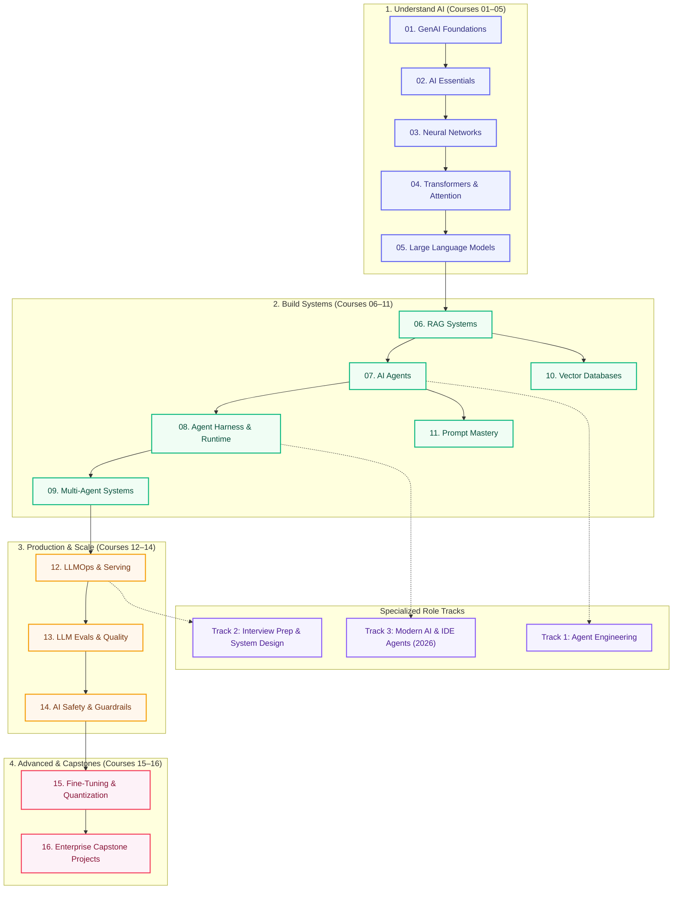

# AI Engineering Hub

  
Free &amp; Open Source

  
The path from transformers to production AI

  
One sequential curriculum — transformers, RAG, agents, harnesses, evals, and LLMOps. No scattered tutorials. Just start at course 01 and build real systems.

  

    <a class="hero__btn hero__btn--primary" href="start-here/">Start Here</a>
    <a class="hero__btn hero__btn--secondary" href="learn/">Browse 16 Courses</a>
    <a class="hero__btn hero__btn--github" href="https://github.com/psssnikhil/ai-engineering-hub">★ Star on GitHub</a>
  

  16 Courses
  140+ Lessons
  3 Specialized Tracks
  30+ Hands-on Labs
  MIT License

---

## Quick start path

  <a class="phase-step" href="start-here/">
    1
    
      Start Here
      Pick a path by background
    
  </a>
  <a class="phase-step" href="learn/">
    2
    
      Browse Courses
      16 courses, sequential order
    
  </a>
  <a class="phase-step" href="learn/study-plans/">
    3
    
      Study Plans
      Week-by-week schedule
    
  </a>
  <a class="phase-step" href="projects/build-these/">
    4
    
      Build Projects
      Ship a portfolio piece
    
  </a>

---

## 🗺️ Curriculum Architecture

---

## 🎯 Who is this for?

  

    
🌱

    
New to AI

    
Software engineer or student starting from ground zero with Python and LLMs.

    <a class="persona-card__cta" href="start-here/">Start Here →</a>
  

  

    
🧠

    
Know ML, need LLMs

    
ML practitioner catching up on modern transformers, APIs, vector DBs, and fine-tuning.

    <a class="persona-card__cta" href="learn/">Browse Curriculum →</a>
  

  

    
🤖

    
Building AI Agents

    
Engineer shipping autonomous agent loops, tools, MCP, and multi-agent systems.

    <a class="persona-card__cta" href="agent-engineering/">Agent Track →</a>
  

  

    
⚡

    
IDE &amp; Coding Agents

    
Mastering Claude Code, Cursor skills, execution loops, and context engineering.

    <a class="persona-card__cta" href="ai-engineering-2026/">Modern AI (2026) →</a>
  

  

    
🛡️

    
Shipping to Production

    
Architecting LLMOps, automated evals, continuous monitoring, and security guardrails.

    <a class="persona-card__cta" href="production/module-10-llmops-production-systems/">Production Track →</a>
  

---

## More shortcuts

  <a class="quick-nav__item" href="topic-map/">Topic Map</a>
  <a class="quick-nav__item" href="faq/">FAQ</a>
  <a class="quick-nav__item" href="getting-started/">Setup</a>

---

## ⚡ The Learning Roadmap

| Stage | Courses | Core Topics Covered |
|-------|---------|--------------------|
| **1. Understand AI** | 01–05 | NLP → neural nets → transformers → attention → LLM architecture |
| **2. Build Applications** | 06–11 | Modular RAG, autonomous agents, tool runtime, multi-agent systems, vector DBs, prompts |
| **3. Production & Ops** | 12–14 | Serving, vLLM/Ollama, LLMOps, automated evals, safety & guardrail gateways |
| **4. Advanced** | 15–16 | Fine-tuning (LoRA/QLoRA), quantization, enterprise capstones |

Specialized tracks: [Agent Engineering](agent-engineering/index.md) · [Interview Prep & System Design](interview-prep/index.md) · [Modern AI (2026)](ai-engineering-2026/index.md)

---

## 🤝 Contribute & Star

If this open handbook helps you learn or ship AI systems, **[star the repository on GitHub](https://github.com/psssnikhil/ai-engineering-hub)** to support open AI education.

Improve a lesson, fix a link, or submit an exercise: [Contribute Guide](contribute.md) · [Roadmap](roadmap.md)

