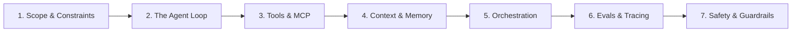

# Agent System Design Interviews

The signature round for **Agent Engineer** and **Senior AI Engineer** roles. You are tasked with designing a complex autonomous or semi-autonomous AI system end-to-end and defending architectural trade-offs under whiteboard pressure.

---

## The 7-Step Interview Framework

Use this structured sequence during every 45-minute whiteboard session:

1. **Clarify the Task Envelope** — What is the agent's degree of autonomy? What is the blast radius of an incorrect action? Is a human-in-the-loop required for destructive/financial operations?
2. **The Agent Loop** — Model choice → tool call generation → environment execution → observation → termination criteria (max iterations, token budgets, explicit final answer tag).
3. **Tools & Sandboxing** — Defining JSON schemas, Model Context Protocol (MCP) integrations, timeout handling, and isolated container execution (e.g. gVisor / Docker).
4. **Context & Memory Strategy** — Sliding window context management, message summarization, semantic vector memory, and state persistence.
5. **Orchestration Architecture** — Single ReAct agent vs hierarchical multi-agent teams (supervisor/worker or swarm architectures).
6. **Evals & Observability** — OpenTelemetry tracing, trajectory evaluation (Ragas, Braintrust, LangSmith), regression test suites, and cost/latency tracking.
7. **Safety & Permissioning** — Action authorization gates, prompt injection filtering, and secret isolation.

---

## Worked System Design Case Studies

Explore full end-to-end architectural walkthroughs in the handbook:

- 🏗️ **[Design an Agent Platform](design-agent-platform.md)** — Multi-tenant platform running autonomous coding and support agents at scale.
- 🔍 **[Design a RAG System](design-rag-system.md)** — Retrieval-augmented Q&A over 50M private documents with ACL enforcement.
- ⚡ **[Design an LLM Serving System](design-llm-serving.md)** — Low-latency, high-concurrency inference platform with PagedAttention.
- 📊 **[Design an Eval Pipeline](design-eval-pipeline.md)** — CI/CD quality testing and real-time monitoring for production LLMs.

---

## Core Handbook References

- [The Agent Loop](../agent-engineering/01-agent-loop.md)
- [Memory Systems](../agent-engineering/02-memory.md)
- [Tools & MCP Protocol](../agent-engineering/03-tools-and-mcp.md)
- [Multi-Agent Orchestration](../agent-engineering/05-orchestration.md)
- [Agent Trajectory Evals](../agent-engineering/07-agent-evals.md)