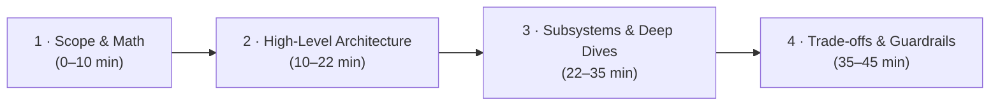

# Agent System Design Interviews

The signature round for **Agent Engineer**, **AI System Architect**, and **Senior AI Engineer** roles. You are tasked with designing a complex autonomous or production AI system end-to-end and defending architectural trade-offs under whiteboard pressure.

---

## The 45-Minute Whiteboard Time Management Framework

| Phase | Time | What to deliver |
|-------|------|-----------------|
| **1. Scope & Math** | 0–10 min | Clarify functional/non-functional requirements, tenant model, blast radius, latency SLAs, and run Back-of-Envelope calculations (throughput, RAM, storage, token costs). |
| **2. High-Level Architecture** | 10–22 min | Draw the end-to-end block diagram: API Gateway $\rightarrow$ Orchestrator $\rightarrow$ LLM Router $\rightarrow$ Tool Sandboxes $\rightarrow$ Vector DB $\rightarrow$ Trace Lake. |
| **3. Subsystem Deep Dives** | 22–35 min | Zoom into 2 key components (e.g. Action Policy Gate, Single-Pass HNSW Filter, Streaming Token Interceptor). |
| **4. Trade-offs & Failure Modes** | 35–45 min | Walk through architectural trade-off table, edge cases, circuit breakers, and canary rollouts. |

---

## Back-of-Envelope Math Cheat Sheet for AI System Design

### 1. Vector Database Sizing Formula
To estimate RAM required for uncompressed 1536-dimensional float32 embeddings:

\[
\text{Raw RAM} = N \text{ (vectors)} \times d \text{ (dimensions)} \times 4 \text{ bytes}
\]

*Example:* $1,000,000,000 \text{ vectors} \times 1536 \times 4 \approx 6.14 \text{ TB RAM}$.  
With **Product Quantization (PQ16)** (64 bytes/vector): $1,000,000,000 \times 64 \text{ bytes} \approx 64 \text{ GB RAM}$. Add 30% for HNSW graph edges $\rightarrow \approx 85 \text{ GB RAM Total}$.

### 2. Token Throughput & Concurrency
To calculate peak LLM API request throughput:

\[
\text{LLM Calls / sec} = \frac{\text{Concurrent Active Sessions} \times \text{Turns per Session}}{\text{Avg Session Duration (seconds)}}
\]

*Example:* 10,000 active sessions $\times$ 8 turns / 120s = **666 LLM calls/sec**.

### 3. GPU Memory Sizing for Model Serving (KV Cache & Weights)
For a model with $P$ billion parameters operating in FP16 (2 bytes/param):

\[
\text{Weights RAM} = P \times 2 \text{ GB}
\]

*Example:* Llama-3 70B requires $70 \times 2 = 140 \text{ GB RAM}$ for weights alone (minimum $2 \times \text{A100 80GB}$ GPUs).

---

## Worked System Design Case Studies

Explore full end-to-end architectural walkthroughs in the handbook:

- 🏗️ **[Design an Agent Platform](design-agent-platform.md)** — Multi-tenant platform running autonomous coding and support agents at scale.
- 💻 **[Design a Coding Agent & IDE Assistant](design-code-agent.md)** — Autonomous coding assistant (Claude Code / Cursor style) with repo mapping and sandboxed edits.
- 🔄 **[Design an Agent Data Flywheel](design-agent-data-flywheel.md)** — Continuous self-improvement loop converting production traces into SFT/DPO datasets.
- 🔍 **[Design a RAG System](design-rag-system.md)** — Retrieval-augmented Q&A over 50M private documents with ACL enforcement.
- ⚡ **[Design an Enterprise Hybrid Vector Search Engine](design-vector-search-engine.md)** — Sub-50ms HNSW + BM25 hybrid vector database for 1B vectors.
- 🛡️ **[Design an AI Safety & Guardrails Gateway](design-ai-guardrails-gateway.md)** — Sub-20ms streaming reverse proxy for PII scrubbing and prompt injection defense.
- 🚀 **[Design an LLM Serving System](design-llm-serving.md)** — Low-latency, high-concurrency inference platform with PagedAttention.
- 📊 **[Design an Eval Pipeline](design-eval-pipeline.md)** — CI/CD quality testing and real-time monitoring for production LLMs.

---

## Core Handbook References

- [The Agent Loop](../agent-engineering/01-agent-loop.md)
- [Memory Systems](../agent-engineering/02-memory.md)
- [Tools & MCP Protocol](../agent-engineering/03-tools-and-mcp.md)
- [Multi-Agent Orchestration](../agent-engineering/05-orchestration.md)
- [Agent Trajectory Evals](../agent-engineering/07-agent-evals.md)
- [Data Flywheel Systems](../agent-engineering/08-data-flywheels.md)