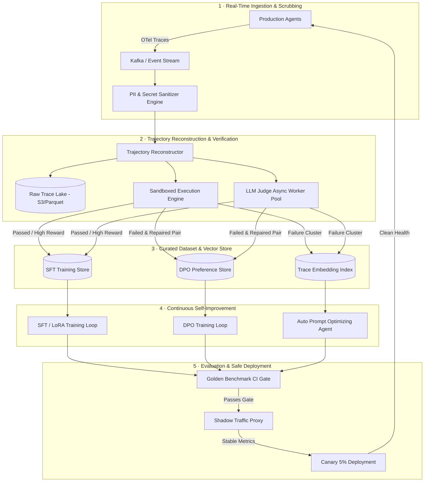

# Case Study: Design an Agent Data Flywheel & Self-Improvement Pipeline

**The Prompt:** "Design a closed-loop Data Flywheel platform for an autonomous software development agent (like Claude Code or Devin). The platform must ingest 10 million agent step traces daily, filter noise, execute sandboxed code verifiers, run SFT/DPO fine-tuning loops, auto-optimize system prompts, and safely deploy improved models without regression."

---

## 1. Clarifying Questions

1. **Agent Domain & Feedback Signals** — Is this purely code generation, or multi-domain tool execution?
   *Assume: Software engineering & SQL execution agents where deterministic execution (unit test pass/fail, build status, linter exits) provides clear ground-truth signals.*
2. **Scale & Throughput** — How many trajectories and steps are processed per day?
   *Assume: 10M agent steps/day (~100K complete trajectories/day, ~100 steps per trajectory).*
3. **Turnaround Latency SLA** — How quickly must an observed production failure update the system?
   *Assume: Prompt/skill patches within 1 hour; fine-tuned model checkpoints updated daily via asynchronous batch training.*
4. **Safety & Compliance Constraints** — What privacy and security constraints exist on production logs?
   *Assume: Strict PII, customer source code, and API token scrubbing required before data enters the training store.*

---

## 2. Requirements & Back-of-Envelope Math

### Functional Requirements
- **Trace Ingestion & Parsing**: Ingest multi-turn OpenTelemetry agent traces (thoughts, tool calls, tool responses, environment states).
- **Multi-stage Verification**: Execute sandboxed code tests, linter checks, and LLM-as-a-judge scoring on ingested trajectories.
- **Self-Improvement Pipelines**:
  - *Distillation/SFT*: Convert high-reward frontier model trajectories into training pairs for small models.
  - *RLEF/DPO*: Pair failed vs repaired trajectories for preference learning.
  - *Auto-Prompt Optimization*: Update system prompts and tool descriptions using failing trace clusters.
- **Safety Rollout & Canary Gate**: Shadow deploy candidate models and run regression benchmarks prior to 100% production traffic.

### Non-Functional Requirements
- **High Throughput Ingestion**: Handle 10M traces/day without dropping production telemetry.
- **Data Isolation & Scrubbing**: 0% PII / API token leakage into training datasets.
- **Zero-Regression Deployment**: 0% regression on core golden benchmarks during auto-rollouts.

### Back-of-Envelope Scale

| Metric | Calculation | Estimate |
|--------|-------------|----------|
| Total Daily Traces | 10,000,000 steps | ~115 steps/sec avg (peak ~500 steps/sec) |
| Avg Payload per Trace Step | ~4 KB (prompt context, tool args, output) | 40 GB / day raw telemetry |
| Verified Positive Trajectories (5%) | 100K total trajectories × 5% success filtering | ~5,000 high-reward training trajectories/day |
| Training Dataset Storage | 5,000 trajectories × 50 KB full trajectory JSON | ~250 MB curated SFT dataset/day |
| Sandboxed Execution Cluster | 100K daily runs × 5 sec execution time | ~12 concurrent gVisor/Docker runner nodes |

---

## 3. High-Level System Architecture

---

## 4. Deep Dive: Key Subsystems

### A. Trajectory Reconstruction & Scrubbing
Agent steps arrive asynchronously across distributed nodes. The **Trajectory Reconstructor** uses `session_id` and OpenTelemetry span DAGs to assemble multi-turn state histories.

- **Secret Scrubbing**: Regex patterns match standard API key formats (`sk-`, `ghp_`, `bearer`), combined with Named Entity Recognition (NER) models for PII (names, emails, IP addresses).
- **Trajectory Windowing**: Traces exceeding 100 turns or 128K context tokens are truncated using key-step sampling (retaining initial system prompt, error steps, and terminal resolution).

### B. Dual Verification Engine (Deterministic + LLM Judge)
To avoid training models on hallucinated or incomplete runs:

1. **Deterministic Sandboxed Execution**: For coding/SQL agents, code payloads are isolated inside gVisor containers and run against ground-truth unit tests.
2. **LLM-as-a-Judge Tier**: For subjective reasoning, an LLM judge evaluates trajectory efficiency using a structured schema:

$$\text{Reward Score } R(\mathcal{T}) = w_1 \cdot \text{Correctness} + w_2 \cdot \text{Efficiency} + w_3 \cdot \text{Safety}$$

where $w_1 = 0.5$, $w_2 = 0.3$, $w_3 = 0.2$. Only trajectories with $R(\mathcal{T}) \ge 0.85$ enter the SFT dataset.

### C. Continuous Model Training & Dynamic Prompt Optimization
- **SFT Distillation**: Runs nightly using LoRA (Low-Rank Adaptation) on 70B parameter models, reducing training cost by 80%.
- **DPO Preference Pairs**: Pairs a failed trajectory step $a_{rejected}$ with the successful counterfactual execution $a_{chosen}$ to train token log-probability preferences.
- **Dynamic Prompt Patching**: Clustering failure vectors identifies systemic operational gaps (e.g. "agent repeatedly forgets to pass `-y` to `apt-get`"). An automated optimizer generates system prompt amendments (e.g. "Always append non-interactive flags `-y` to package manager commands").

---

## 5. Architectural Trade-Offs

| Option A | Option B | Chosen Strategy | Rationale |
|----------|----------|-----------------|-----------|
| **LLM-only filtering** | **Deterministic Sandbox + LLM Judge** | Deterministic Sandbox + LLM Judge | LLM judges drift and exhibit self-bias; sandbox tests provide ground truth for code/SQL. |
| **Real-time online SFT** | **Nightly Batch SFT + Rapid Prompt Patches** | Nightly Batch + Rapid Prompt Patches | Online model retraining risks catastrophic collapse; prompt patches deploy in 1 hr while models train nightly. |
| **Full Fine-Tuning** | **LoRA / QLoRA Parameter Efficient Tuning** | LoRA Tuning | LoRA reduces memory overhead and allows hot-swapping task adapters without redeploying base models. |
| **Direct Production Deploy** | **Shadow Proxy $\rightarrow$ Canary Gate** | Shadow Proxy $\rightarrow$ Canary Gate | Shadowing live traffic verifies latency, token consumption, and failure rates without impacting real users. |

---

## 6. Failure Modes & Mitigations

- **Model Collapse via Circular Training**:
  - *Risk*: Training a model solely on its own synthetic outputs leads to progressive degradation in reasoning diversity.
  - *Mitigation*: Enforce a strict minimum of 20% human-verified traces and frontier model (e.g. Claude 3.7 Sonnet) reference trajectories in every SFT batch.
- **Data Leakage into Training Set**:
  - *Risk*: Confidential user code or database passwords leaking into fine-tuned weights.
  - *Mitigation*: Run pre-ingestion scrubbers + hash-matching data deduplication against secret vault patterns.
- **Regressions on Infrequent Tasks**:
  - *Risk*: Optimizing for high-frequency user tasks degrades performance on rare edge cases.
  - *Mitigation*: Maintain a permanent **Golden Benchmark Suite** (500+ diverse trajectories) that candidate models must 100% pass before deployment.

---

## 7. Observability, Tracing & Data Flywheel Evals

### A. Telemetry Collection & Distributed Tracing
- **Trace Exporter**: Production agent platforms emit OpenTelemetry traces (`agent.session`, `agent.step`, `tool.exec`) directly into Kafka / Kinesis streams.
- **Span Metadata Enriched for Curation**:
  - `trajectory.id`, `task_domain`, `tool_call_sequence`, `execution_status`.
  - `llm_reward_score`, `sandbox_test_status`, `user_feedback_score`.

### B. Flywheel Production Metrics
- **Trajectory Yield Rate**:
  - `flywheel_raw_traces_collected_total` vs `flywheel_curated_preference_pairs_total` (Conversion % of raw logs to DPO pairs).
- **Model Evolution Metrics**:
  - `sft_model_win_rate_vs_base` (Win-rate % of newly fine-tuned model against current production base).
  - `flywheel_auto_eval_accuracy` (Correlation score between automated LLM judge rewards and ground-truth human annotations).
- **Quality SLA**:
  - Retain 0% unverified trajectories in SFT datasets. Target > 85% DPO preference pair score delta.

### C. Continuous Drift & Performance Monitoring
- **Data Drift Detection**: Monitor distribution changes in user prompts and tool calling frequency.
- **Regression Gates**: Shadow proxy comparison running live production queries in parallel through new LoRA adapter vs current base model with zero latency impact to users.

---

## 8. Key Takeaways & Interview Summary

- **Ground Truth Verification**: Always prefer deterministic execution verifiers (sandbox unit tests, AST parsers) over pure LLM-as-a-judge evaluation.
- **Two-Speed Improvement**: Use **Prompt/Skill Patching** for fast 1-hour fixes, and **Nightly SFT/DPO** for deep architectural capabilities.
- **Safety Pipeline**: Require PII scrubbing, LoRA adapter isolation, Shadow Proxy testing, and automated canary rollback triggers.
