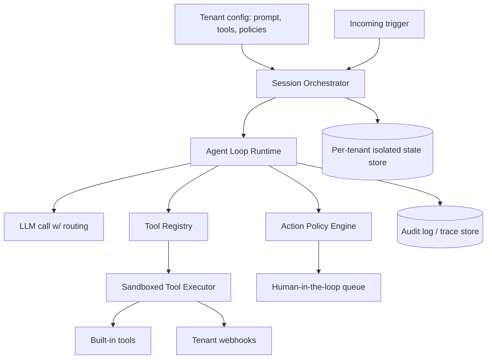

# Design an Agent Platform

**The prompt:** "Design a multi-tenant platform that lets customers configure and run
autonomous agents (e.g. customer-support resolution agents) that can call tools,
including ones with real side effects like issuing refunds."

## Clarifying questions

1. **Tenancy model** — is this fully multi-tenant SaaS (many customers, isolated data),
   or single-org internal? *Assume: multi-tenant SaaS, strict data isolation required.*
2. **Agent autonomy level** — fully autonomous, or human-in-the-loop for some actions?
   *Assume: mixed — tiered by action risk (see [Evals & Production Q&A](questions-evals-production.md) Q6).*
3. **Concurrency** — how many agent sessions run concurrently per tenant, and across all
   tenants? *Assume: up to 10K concurrent sessions platform-wide, bursty by tenant
   traffic.*
4. **Tool surface** — fixed platform tools, or can tenants register custom tools/APIs?
   *Assume: both — built-in tools plus tenant-registered webhooks.*
5. **Session duration** — short (single resolution, <5 min) or long-running (hours,
   multi-day)? *Assume: mostly short, but must support long-running research/workflow
   agents too.*
6. **Compliance** — any regulatory constraints (PCI, HIPAA) affecting what an agent can
   access or log? *Assume: PCI-adjacent — agents may see payment-related context, so
   redaction/handling matters.*

## Requirements

**Functional:** tenant-configurable agent (prompt/tools/policies); execute a
perceive-reason-act-observe loop with tool calls; tiered approval for risky actions;
full audit trail per session.

**Non-functional:** strict per-tenant data isolation; p95 agent-turn latency < 4s;
support 10K concurrent sessions; bounded cost per session (no runaway loops); tool
execution sandboxed so a misbehaving agent can't affect other tenants.

**Back-of-envelope numbers:**

| Quantity | Estimate |
|---|---|
| Concurrent sessions (peak) | 10,000 |
| Avg turns/session | 8 |
| Avg tokens/turn (context + generation) | ~3,000 |
| Peak LLM calls/sec | 10,000 sessions × (8 turns / ~90s session duration) ≈ ~900 calls/sec |
| Tool calls/session | ~4 |

The ~900 LLM calls/sec figure is the number that determines whether you need multiple
model provider accounts/regions, request queuing with backpressure, or a
routing/cascade strategy to stay within provider rate limits and control cost.

## High-level architecture

- **Session orchestrator** — spins up an isolated agent session per request, loads
  tenant config (system prompt, allowed tools, risk policies), enforces a hard turn/cost
  budget per session.
- **Agent loop runtime** — the perceive/reason/act/observe cycle; calls the LLM through a
  routing layer that can load-balance across provider regions/accounts and apply
  cascade routing (cheap model first, escalate on low confidence).
- **Tool registry + sandboxed executor** — every tool call runs in an isolated execution
  context scoped to that tenant's credentials/data only; tenant-registered webhooks are
  called with a signed request and a strict timeout so one tenant's slow endpoint can't
  starve the platform.
- **Action policy engine** — intercepts every tool call before execution, checks it
  against the tenant's risk tiering (auto-approve / require human approval / hard-block),
  enforced here, not just in the prompt — see [Agents Q&A Q6](questions-agents.md).
- **Audit/trace store** — every perceive/reason/act/observe step logged per session,
  queryable per tenant, both for debugging and compliance.

## Deep dive: tenant isolation under shared infrastructure

Multi-tenant agent platforms have a specific isolation risk beyond normal SaaS: an
agent's *context* can accidentally mix tenant data (e.g. a shared tool-response cache
keyed incorrectly, or a memory/RAG store queried without a tenant filter — same failure
class as the RAG ACL problem in [Design a RAG System](design-rag-system.md)). The
mitigation is to make tenant ID a mandatory, non-optional dimension threaded through
every layer: session state keyed by `tenant_id`, tool credentials resolved per-tenant
(never a shared credential pool), and any shared caches (e.g. an embedding cache) keyed
including `tenant_id` even when the underlying content is identical across tenants,
trading some cache hit rate for a hard isolation guarantee rather than relying on
application logic to always filter correctly.

## Deep dive: the action policy engine

This is the component that turns "the model decided to call `issue_refund`" into "the
refund actually happens." It must be enforced *outside* the model, at the tool-execution
layer, because prompt-level instructions are a soft constraint that can fail under
injection, context degradation, or model error (see [Agents Q&A Q6](questions-agents.md)).
Concretely: each tool has a declared risk tier and, for parameterized tools like refunds,
a tier that can depend on the parameter value (e.g. `refund(amount)` — auto-approve under
$20, HITL queue above it). The policy engine sits between the agent loop and the tool
executor as a hard gate — a tool call that requires approval is queued, the session
pauses (not blocked indefinitely — with its own timeout/escalation), and only proceeds to
execution once approved. This also gives you the audit trail for free: every
gated decision has a record of what was requested, by which policy it was
routed, and who approved it.

## Tradeoffs

| Decision | Option A | Option B | Chosen | Why |
|---|---|---|---|---|
| Tool call risk gating | Enforced via system prompt only | Enforced at tool-executor layer | Executor layer | Prompt-level constraints are soft and can fail under injection or model error |
| Cache keying | Shared cache across tenants | Cache keyed by tenant_id even for identical content | Tenant-keyed | Hard isolation guarantee is worth the reduced cache hit rate for a compliance-relevant surface |
| LLM routing | Single model for all sessions | Cascade (cheap model first, escalate) | Cascade | Reduces average cost per session at ~900 calls/sec scale without giving up quality on hard cases |
| Session termination | Model self-reports "done" only | Model signal + turn/cost budget + stagnation detector | Combined | Any single signal has a distinct failure mode — see [Agents Q&A Q3](questions-agents.md) |

## Failure modes & mitigations

- **Runaway session (loop or cost blowout)** — hard per-session turn and cost budget
  enforced by the orchestrator, independent of the model's own termination behavior.
- **Tenant webhook is slow/down** — strict timeout on webhook tool calls; degrade to
  "tool unavailable, ask user to retry later" rather than hanging the session.
- **Provider rate limit hit at peak** — request queue with backpressure plus multi-region
  routing; sessions queue rather than error outright, with a queue-depth-based SLA
  warning surfaced to the tenant.
- **Cross-tenant data leak via shared component** — treat as the top-severity incident
  class; mitigated architecturally (mandatory tenant_id threading) rather than relying on
  per-feature review to catch it every time.
- **HITL queue backs up faster than humans can review** — auto-escalate policy tiers
  temporarily tighten (fewer things auto-approved) is the wrong direction; instead alert
  on queue depth and consider auto-expiring low-risk-adjacent approvals with a
  conservative default (deny, not approve) on timeout.

## Likely follow-ups

- **"How would you let a tenant add a completely custom tool safely?"** — Tenant-defined
  tools (e.g. a webhook) need the same sandboxing as built-in tools: no direct access to
  other tenants' data or credentials, strict timeout, and the tool's own risk tier
  defaults to the most conservative (HITL-required) until the tenant explicitly
  configures otherwise.
- **"How do you evaluate whether this platform's agents are actually helping vs
  making things worse?"** — Task success rate and escalation-to-human rate as the primary
  product metrics, tracked per tenant, with a faithfulness/policy-compliance eval on the
  audit trace sample (see [Evals & Production Q&A](questions-evals-production.md)).
- **"What changes if sessions need to run for days, not minutes?"** — Long-running
  sessions need persisted, resumable state (not just in-memory), a different cost-budget
  model (per-day, not per-session), and periodic human check-ins built into the
  termination/approval design rather than only gating at the end.

## Key takeaways

- Multi-tenant agent platforms have an isolation failure class beyond typical SaaS: agent
  *context* mixing across tenants, not just data-at-rest mixing.
- Action risk gating must be enforced at the tool-execution layer, never solely at the
  prompt layer — this is the single most interview-tested design decision for agent
  platforms.
- Termination and cost control need multiple independent signals, not one.
- Cascade/routing strategies matter once you compute realistic calls-per-second — do the
  back-of-envelope math before assuming a single model tier works.
- Every gated action should produce an audit record as a side effect of the gating
  mechanism, not as separate bolted-on logging.
