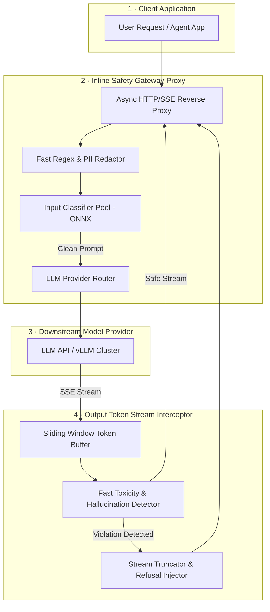

# Case Study: Design a Real-Time AI Safety & Guardrails Gateway

**The Prompt:** "Design a low-latency, enterprise-grade AI Safety Gateway (similar to NeMo Guardrails or Guardrails AI) that proxies all incoming LLM prompts and outgoing generation streams. The gateway must enforce safety policies, detect prompt injections, scrub PII and secrets, detect toxic generations, and block policy violations with less than 20ms added p95 overhead."

---

## 1. Clarifying Questions

1. **Deployment Architecture** — Is this an inline reverse proxy or a sidecar SDK?
   *Assume: Inline reverse proxy (API Gateway model) sitting between client applications and downstream LLM APIs (OpenAI, Anthropic, internal vLLM).*
2. **Throughput & Concurrency** — What scale must the gateway handle?
   *Assume: 50,000 active requests/sec, 100,000 active streaming SSE (Server-Sent Events) connections.*
3. **Latency Overhead SLA** — What is the strict latency budget?
   *Assume: Input prompt evaluation overhead < 15ms; streaming output token evaluation overhead < 5ms per chunk.*
4. **Action Tiers** — What actions can the gateway take on policy violation?
   *Assume: Reject prompt, mask/redact PII in-flight, terminate output stream early with standard error payload.*

---

## 2. Requirements & Back-of-Envelope Math

### Functional Requirements
- **Input Guardrails**: Detect Indirect & Direct Prompt Injections, Jailbreaks, and System Prompt Leaks.
- **Data Privacy & PII Redaction**: Mask credit cards, SSNs, API keys, and PII using regex & fast NER before reaching external LLM APIs.
- **Output Guardrails**: Intercept streaming LLM completions to check for hallucinated facts, toxic speech, and forbidden tool triggers.
- **Policy Configuration**: Tenant-configurable rulesets (e.g. Finance policy vs Customer Support policy).

### Non-Functional Requirements
- **Ultra-Low Latency Overhead**: Sub-20ms p95 latency added to time-to-first-token (TTFT).
- **High Concurrency**: Async streaming I/O without blocking model token generation.
- **High Availability**: 99.999% availability (degrade gracefully to pass-through with audit logging if guardrail engine fails).

### Back-of-Envelope Math

| Metric | Calculation | Estimate |
|--------|-------------|----------|
| Request Volume | 50,000 req/sec | Peak 75,000 req/sec |
| Average Input Prompt Length | 2,000 tokens (~8 KB) | 400 MB/sec incoming network bandwidth |
| Token Stream Rate | 50,000 streams × 30 tokens/sec | 1,500,000 tokens/sec output inspection |
| ONNX Classifier Cluster Memory | 1,500 instances of LlamaGuard-Quantized (250MB each) | ~375 GB RAM across gateway worker pool |

---

## 3. High-Level Architecture



---

## 4. Deep Dive: Key Subsystems

### A. Two-Phase Input Safety Inspection
To achieve sub-15ms input inspection:

1. **Phase 1: Deterministic Fast-Path (Sub-2ms)**:
   - Aho-Corasick string matching for known jailbreak signatures (`"Ignore previous instructions"`, `"[DAN]"` mode).
   - High-speed regex engine for PII/Secrets (`sk-[a-zA-Z0-9]{48}`, SSNs, credit cards).
2. **Phase 2: Quantized SLM Classifier (Sub-10ms)**:
   - Run quantized lightweight BERT/DeBERTa or Llama Guard (8-bit ONNX models on CPU/gRPC nodes).
   - Return binary safety scores across policy dimensions (Violence, Self-Harm, Jailbreak, Copyright).

### B. Streaming Token Interceptor (Output Guardrail)
Output guardrails must evaluate token streams without adding buffering latency:

```python
class StreamingOutputInterceptor:
    def __init__(self, window_size: int = 15):
        self.window_size = window_size
        self.token_buffer = []
        
    async def process_token_stream(self, token_stream):
        async for token in token_stream:
            self.token_buffer.append(token)
            
            # Maintain sliding window for multi-token toxic phrase detection
            window_text = "".join(self.token_buffer[-self.window_size:])
            
            if self.is_policy_violation(window_text):
                # Terminate stream immediately and yield refusal payload
                yield "\n[Output terminated by AI Safety Gateway policy.]"
                return
                
            # Yield safe tokens downstream
            if len(self.token_buffer) > self.window_size:
                yield self.token_buffer.pop(0)
                
        # Flush remaining buffer
        while self.token_buffer:
            yield self.token_buffer.pop(0)
```

### C. Fallback & Circuit Breaker Architecture
If an ONNX classifier node hangs or memory leaks:
- **Circuit Breaker**: If guardrail engine latency > 30ms, open circuit and fall back to regex-only screening while emitting a high-severity alert.
- **Fail-Open vs. Fail-Closed**: Configurable per tenant (Enterprise Finance defaults to fail-closed; Public Chatbot defaults to fail-open with logging).

---

## 5. Architectural Trade-Offs

| Option A | Option B | Chosen | Rationale |
|----------|----------|--------|-----------|
| **Call LLM Guard via API** | **Local Quantized ONNX Pool** | Local Quantized ONNX Pool | Remote API adds >200ms latency; local ONNX runs in <10ms. |
| **Complete Buffer Output** | **Sliding Window Token Stream** | Sliding Window Stream | Complete buffering ruins TTFT (Time To First Token) for real-time streaming apps. |
| **Strict Fail-Closed** | **Tenant Configurable Circuit Breaker** | Configurable Circuit Breaker | Allows high-throughput applications to maintain availability during guardrail service spikes. |

---

## 6. Failure Modes & Mitigations

- **Multi-Token Split Jailbreaks**:
  - *Risk*: Jailbreak payload split across streaming tokens to bypass sliding window.
  - *Mitigation*: Run Input Guardrails on reconstructed full prompt context before any token is generated.
- **False Positive Refusals**:
  - *Risk*: Legitimate security research queries flagged as malicious.
  - *Mitigation*: Contextual intent classifier override; allow tenants to define custom prompt allowlists.

---

## 7. Observability, Tracing & Guardrail Evals

### A. Sub-Millisecond OpenTelemetry Tracing
- **Span Hierarchy**:
  - `guardrail_gateway.request` (Overall proxy latency)
    - `guardrail.input_scan` (Parallel execution of Regex, PII, & Injection classifier)
      - `guardrail.regex_rules` (Sub-1ms matching)
      - `guardrail.onnx_classifier` (Sub-10ms BERT execution)
    - `guardrail.stream_buffer` (Sliding window inspection latency per streaming token chunk)

### B. Guardrail Telemetry & Metrics
- **Security & Performance Metrics**:
  - `guardrail_blocked_requests_total` (Categorized by rule: `prompt_injection`, `pii_leak`, `toxic_output`).
  - `guardrail_overhead_latency_seconds` (Target: P99 < 15ms overhead added to LLM stream).
  - `guardrail_false_positive_rate` (Tracked via user appeal button & shadow eval).
- **Audit Logging**:
  - Encrypted, anonymized security audit log of blocked attack payloads for red-teaming analysis.

### C. Continuous Red Teaming & Security Evals
- **Automated Jailbreak Benchmarks**: Nightly evaluation running 500+ adversarial jailbreak prompts (PyRIT / GCG / TAP attacks) to verify defense robustness before deploying updated ONNX model weights.

---

## 8. Key Takeaways & Interview Summary

- **Streaming Latency**: Never buffer full completions; use sliding window token interceptors to keep latency < 20ms.
- **Two-Phase Inspection**: Combine sub-2ms deterministic regex/Aho-Corasick matching with sub-10ms quantized ONNX classifier pools.
- **Resilience**: Implement circuit breakers and configurable fail-open/fail-closed behaviors for production availability.
