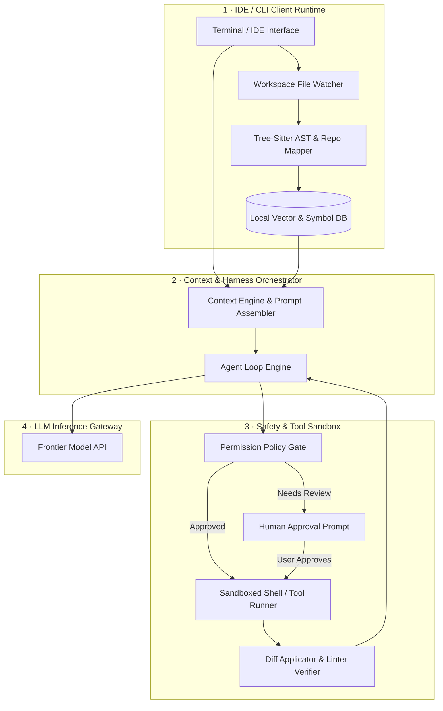
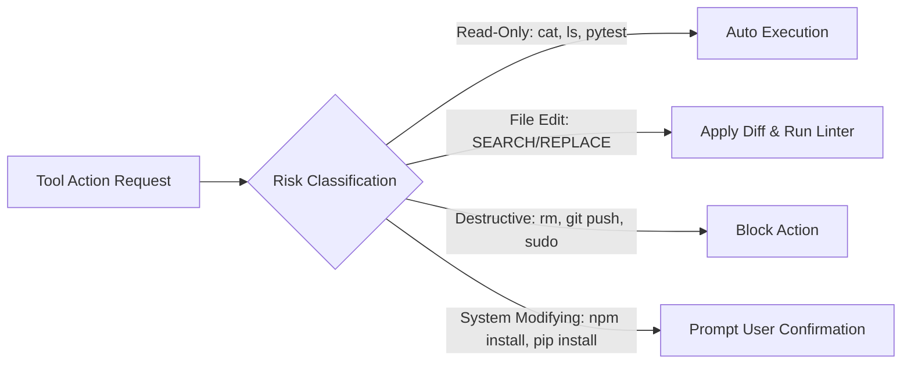

# Case Study: Design a Coding Agent & IDE Assistant

**The Prompt:** "Design an autonomous Coding Agent & IDE Assistant (similar to Claude Code, Cursor, or Windsurf) that runs inside a local or cloud developer workspace. The system must index a multi-gigabyte repository, parse codebase structure, edit multi-file codebases, execute terminal tools safely, and stream diffs to the user in real time."

---

## 1. Clarifying Questions

1. **Operating Environment** — Is this a desktop IDE plugin, CLI tool, or cloud container sandbox?
   *Assume: Hybrid model — local CLI/IDE extension paired with a cloud LLM API, executing tools in a sandboxed local environment.*
2. **Repository Size** — What repository scale must the indexer handle?
   *Assume: Up to 100,000 code files (~2GB text), with sub-second context retrieval for code edits.*
3. **Execution Safety** — Can the agent run arbitrary terminal commands?
   *Assume: Yes, but with tiered human-in-the-loop approvals (e.g. `git status` auto-approved; `rm -rf` or `sudo` blocked).*
4. **Latency Budget** — What is the streaming latency requirement?
   *Assume: Initial token response latency < 1.5s; diff streaming at 30+ tokens/sec.*

---

## 2. Requirements & Back-of-Envelope Math

### Functional Requirements
- **Codebase Parsing & Indexing**: Parse repo ASTs, imports, symbols, and build a local Repository Map.
- **Context Assembling**: Select relevant files, definitions, and diagnostics (linter errors) fitting into the LLM context window.
- **Multi-File Diff Generation**: Stream structured code modifications (`SEARCH/REPLACE` blocks or Unified Diffs).
- **Tool Execution & Terminal Sandbox**: Safely run shell commands (`pytest`, `npm test`, `git`) and feed terminal output back into the loop.
- **Human-in-the-Loop Safety**: Intercept high-risk file modifications or shell executions before execution.

### Non-Functional Requirements
- **Low Memory Footprint**: Local repo indexer must use < 500MB RAM.
- **Sub-Second Search**: Symbol lookup and definition retrieval < 200ms.
- **Deterministic Edits**: Zero hallucinated file paths or corrupted syntax when applying diff patches.

### Back-of-Envelope Math

| Metric | Calculation | Estimate |
|--------|-------------|----------|
| Repository Scale | 100,000 files × avg 200 lines | 20,000,000 lines of code (~150MB text) |
| Symbol Index Size | ~500,000 symbols (functions, classes, types) | ~100MB ctags/SQLite DB |
| Dense Vector Index | 100K files chunked into 300K snippets | 300K × 1536 float32 = 1.8GB index (mmap'd) |
| Token Budget | 128K context window | ~90K code context, ~10K repo map, ~28K history & buffer |

---

## 3. High-Level Architecture



---

## 4. Deep Dive: Key Subsystems

### A. Codebase Indexing & Repo Map Generation
Feeding an entire 100,000-file repository into an LLM context is impossible. The system uses a **Two-Tiered Retrieval Layer**:

1. **Lexical & Symbol AST Indexing**: Uses `Tree-Sitter` to parse code structure into symbols (classes, functions, interfaces, imports). Stores references in a local SQLite/ctags database.
2. **Repo Map Construction**: Generates a compact graph representation using PageRank over function call graphs:

\[
PR(u) = \frac{1-d}{N} + d \sum_{v \in Importers(u)} \frac{PR(v)}{OutDegree(v)}
\]

High-PageRank entry points (e.g. main routing files, core abstractions) are included in system prompts as a high-level map (occupying ~2,000 tokens).

### B. Structured Diff Patching
Instead of rewriting full files, the agent uses structured **Unified Search/Replace Blocks** to ensure deterministic file patching:

```text
<<<<<<< SEARCH
def calculate_total(price, tax):
    return price + tax
=======
def calculate_total(price: float, tax: float, discount: float = 0.0) -> float:
    return max(0.0, (price + tax) - discount)
>>>>>>> REPLACE
```

The **Diff Applicator** verifies exact line matching; if fuzzy matching fails due to concurrent file changes, the system re-reads the target lines and prompts the agent to re-emit the patch block.

### C. Permission & Safety Policy Engine
The tool execution layer intercepts all actions outside the model context:



---

## 5. Architectural Trade-Offs

| Option A | Option B | Chosen Strategy | Rationale |
|----------|----------|-----------------|-----------|
| **Full File Rewrites** | **Search/Replace Block Diffs** | Search/Replace Diffs | Reduces token output cost by 90% and speeds up response streaming. |
| **Cloud Vector Database** | **Local SQLite + Tree-Sitter Index** | Local SQLite + Tree-Sitter | Zero latency, no uploading proprietary user code to 3rd-party vector DBs, works offline. |
| **Raw Bash Execution** | **Sandboxed Terminal Execution** | Sandboxed Execution | Prevents accidental file deletion or network exfiltration from hallucinated agent loops. |

---

## 6. Failure Modes & Mitigations

- **Infinite Linter Repair Loop**:
  - *Symptom*: Agent attempts to fix a syntax error, creates a new error, and spins indefinitely.
  - *Mitigation*: Hard cap of 3 repair turns per error snippet; if unsolved, request user guidance.
- **Context Bloat on Large Test Logs**:
  - *Symptom*: Running `pytest` outputs 50,000 lines of failure traces, exhausting LLM context.
  - *Mitigation*: Truncate test output to stack trace headers and first 3 failing assertions.
- **Stale Index during Fast Edits**:
  - *Symptom*: User edits code in editor while agent is reasoning, causing invalid line offsets.
  - *Mitigation*: File watcher triggers incremental AST updates on `onSave` events.

---

## 7. Observability, Tracing & Coding Agent Evals

### A. Distributed OpenTelemetry Tracing
- **Trace Context**: Trace whole session starting from prompt input down to terminal tool executions and AST graph resolution.
- **Span Hierarchy**:
  - `code_agent.turn` (User instruction trace)
    - `code_agent.repo_map` (Tree-Sitter symbol extraction & graph lookup latency)
    - `code_agent.llm.reason` (Token count, reasoning duration, TTFT)
    - `code_agent.patch.apply` (Diff validation and line offset matching)
    - `code_agent.sandbox.exec` (Subshell command runtime: `pytest`, `eslint`)

### B. Telemetry & Quality Metrics
- **Performance Metrics**:
  - `code_agent_patch_success_rate` (% of generated search/replace patches applied without line offset error).
  - `code_agent_test_pass_rate` (% of runs where generated edits pass repository unit tests).
  - `code_agent_mean_turns_to_resolve` (Average LLM reasoning turns per bug fix / feature addition).
- **Cost & Latency SLAs**:
  - Token consumption per editing session (Input/Output breakdown).
  - Target SLA: Sub-second response streaming startup (< 400ms TTFT).

### C. SWE-bench & Coding Evals Pipeline
- **Continuous Harness**: Evaluate agent on SWE-bench Light & custom repository test suites.
- **Automated Regression Gate**: Run patch generation against held-out repositories to measure functional correctness, syntax error rates, and hallucinated import occurrences.

---

## 8. Key Takeaways & Interview Summary

- **Hybrid Indexing**: Combine AST Tree-Sitter symbol graphs with sparse lexical search for sub-second code retrieval.
- **Patch Precision**: Use explicit Search/Replace blocks over full-file generation to optimize latency and token costs.
- **Hard Execution Gating**: Enforce safety outside the model using a strict permission policy engine.
