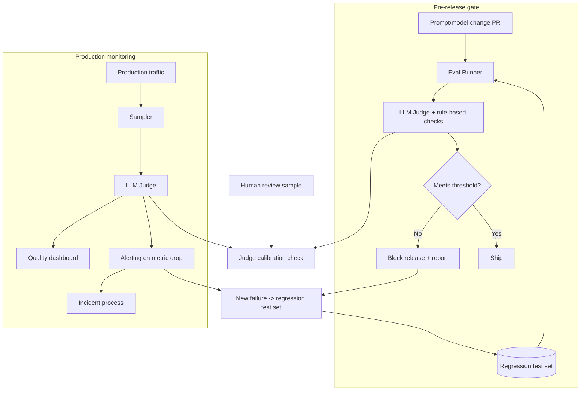

# Design an Eval Pipeline

**The prompt:** "Design a system that continuously measures the quality of an LLM-powered
customer support product, catches regressions before they reach users, and gives the team
confidence to ship prompt/model changes frequently."

## Clarifying questions

1. **What does "quality" mean for this product specifically?** — accuracy, tone,
   resolution rate, safety? *Assume: a composite of faithfulness (no hallucinated policy
   claims), task resolution rate, and safety/tone compliance.*
2. **Release cadence** — how often do prompt/model changes ship? *Assume: multiple times
   per week, sometimes same-day for prompt tweaks.*
3. **Human review capacity** — how much human-labeled data can the team realistically
   produce/review per week? *Assume: limited — a few hundred human-reviewed samples/week,
   not enough to gate every change on human review alone.*
4. **Is there a production traffic sample available, or only synthetic test sets?**
   *Assume: both — a curated regression test set plus a sampled stream of real
   (anonymized) production traffic.*
5. **What's the cost of a bad release reaching users?** — silent quality dip vs a
   safety-relevant failure. *Assume: high — this is customer-facing and a bad release
   affects real customer interactions before anyone notices via dashboards alone.*
6. **Offline-only, or does this need online/production monitoring too?** *Assume: both —
   pre-release gating (offline) and continuous production monitoring (online), since
   offline test sets can't cover every real-world input distribution shift.*

## Requirements

**Functional:** automated pre-release eval gate (blocks a bad change from shipping);
continuous production quality monitoring (catches drift/regressions offline tests missed);
a workflow for turning found failures back into new test cases (the eval set must grow,
not stay static).

**Non-functional:** eval gate result available within the CI cycle time teams already
tolerate (not adding hours to every prompt tweak); production monitoring must surface a
regression within hours, not the next time someone happens to look at a dashboard; eval
system itself must be periodically validated against human judgment or it becomes a
metric teams stop trusting.

**Back-of-envelope numbers:**

| Quantity | Estimate |
|---|---|
| Prompt/model changes/week | ~10 |
| Regression test set size (target) | ~500 curated cases, growing |
| Production traffic sampled/day for monitoring | ~2,000 conversations |
| Human review capacity | ~300 samples/week |
| LLM-judge calls for a full eval run (500 cases × ~3 metrics) | ~1,500 judge calls per gate run |

The human-review-capacity number (300/week) versus release cadence (10/week, each
potentially wanting eval coverage) is the number that forces LLM-judge automation rather
than pure human review — there just isn't enough human bandwidth to gate every change
manually.

## High-level architecture



- **Regression test set** — curated cases with known-good expected properties (not
  necessarily one golden answer — often a rubric), continuously grown from real failures
  found either offline or in production (closes the loop, see deep dive).
- **Eval runner + LLM judge** — runs the candidate prompt/model against the full
  regression set, scores each response against the rubric (faithfulness, resolution,
  tone/safety), and rule-based checks for anything that doesn't need a judge (PII
  leakage regex, banned-phrase checks, format validation).
- **Gate** — a change ships only if aggregate scores meet the threshold and no
  regression-set case that previously passed now fails (catches localized regressions a
  pure average score can hide).
- **Production sampler + monitor** — continuously scores a sample of real traffic the
  same way, on a dashboard, with alerting on metric drops — this is what catches
  distribution shift the offline test set didn't anticipate.
- **Judge calibration loop** — a slice of both offline and production judged samples get
  human review to measure judge-human agreement over time (see deep dive).

## Deep dive: closing the loop from production failures to test cases

An eval pipeline that never grows its regression set slowly becomes stale — it only
protects against failure modes already known when it was built. The design needs an
explicit, low-friction path: any case that fails a production quality check (or gets
flagged by a human, e.g. a support escalation caused by a bad agent answer) gets
triaged and, if it represents a genuinely new failure pattern (not a duplicate of an
existing test case), added to the regression set with the correct expected behavior
documented. This turns every real-world failure into permanent protection against that
class of regression recurring — the single highest-leverage part of the system over
time, more valuable long-run than any one gate threshold tuning.

## Deep dive: judge calibration — keeping the automated metric trustworthy

The LLM judge is only useful if its scores track real quality, and it can silently drift
out of alignment with human judgment (a model version update behind the judge API changes
its scoring tendencies; the rubric stops matching what the product actually needs as
requirements evolve). The pipeline needs a standing calibration loop: a fixed percentage
of judged samples (both offline gate runs and production monitoring) get routed to human
reviewers blind to the judge's score, and judge-human agreement (e.g. Cohen's kappa or
simple accuracy against a binary pass/fail framing) is tracked over time on a dashboard.
A sustained drop in agreement is itself an alert condition — it means the team should stop
trusting gate results until the rubric or judge is re-validated, the same way you
wouldn't trust a sensor that's failed its own calibration check.

## Tradeoffs

| Decision | Option A | Option B | Chosen | Why |
|---|---|---|---|---|
| Primary scoring method | Human review of every change | LLM-judge automated scoring, human-validated | LLM-judge | Human capacity (300/week) can't cover release cadence (10 changes/week × 500 test cases) |
| Gate criteria | Single aggregate score threshold | Aggregate threshold + no-regression-on-previously-passing-cases check | Combined | An aggregate average can hide a localized regression on a specific case category |
| Test set growth | Static, curated once | Continuously grown from real failures | Continuous | A static set only protects against already-known failure modes; real coverage requires closing the loop from production |
| Monitoring scope | Offline gate only | Offline gate + continuous production monitoring | Both | Offline test sets can't anticipate every real-world input distribution shift |

## Failure modes & mitigations

- **Judge drift silently degrades gate reliability** — standing calibration loop (above)
  with an explicit alert on agreement drop, not a one-time validation at launch.
- **Regression set grows unbounded and eval runs get too slow for CI cadence** —
  periodically prune duplicate/redundant cases (cases where the pass/fail outcome
  perfectly correlates with another existing case across recent runs are candidates for
  removal), and parallelize judge calls rather than letting set growth silently blow the
  CI time budget.
- **Team starts ignoring gate failures because of false positives** — track and
  publish the gate's own false-positive rate (cases where a blocked release was manually
  reviewed and found actually fine); a rising false-positive rate is a signal to
  re-tune the rubric/threshold before trust erodes and people route around the gate.
- **Production monitoring alert fires but nobody owns triage** — an eval alert without a
  clear on-call/triage owner decays into noise; treat it with the same incident-response
  discipline as any other production alert (see [Evals & Production Q&A Q5](questions-evals-production.md)).

## Deep dive: Eval Pipeline Observability, Tracing & Inter-Judge Reliability

```text
[CI Build Trigger] ──> [Eval Dispatcher Span]
                              │
         ┌────────────────────┼────────────────────┐
         ▼                    ▼                    ▼
[Dataset Loader]     [Judge Batch Runner]    [Cohen's Kappa Calibration]
 ├─> Version Tag      ├─> Parallel LLM Calls  ├─> Human vs Judge Agreement
 └─> Case Sampling    └─> Rubric Parsing      └─> Bias & Drift Tracking
```

### 1. Distributed Tracing for Eval Execution
- **Span Hierarchy**:
  - `eval_run.execution` (Root trace for CI evaluation run)
    - `eval.dataset_load` (Golden dataset versioning and stratification)
    - `eval.test_case` (Individual test case execution)
      - `eval.candidate_gen` (Candidate model output generation)
      - `eval.judge_score` (LLM-as-a-judge scoring latency and reasoning trace)

### 2. Inter-Judge Reliability & Production Metrics
- **Reliability & Consistency Metrics**:
  - `eval_judge_human_cohens_kappa` (Target: $\kappa > 0.75$ correlation between LLM judge and human experts).
  - `eval_judge_self_consistency_score` (Variance in judge scores when fed identical inputs at temp 0.0).
  - `eval_ci_pipeline_duration_seconds` & `eval_cost_per_run_usd`.
- **Regression Alert Thresholds**:
  - Block PR build if `faithfulness_score` drops > 2% or any critical security test case fails.

## Likely follow-ups

- **"How would you evaluate a genuinely new capability (e.g. a new tool the agent didn't
  have before) with no historical failure data to build a test set from?"** — Start from
  hand-authored adversarial/edge cases based on the tool's risk profile (similar to how
  [Design an Agent Platform](design-agent-platform.md) tiers tool risk), ship behind a
  feature flag to a small traffic percentage with tighter human review, and grow the
  regression set from what that limited rollout surfaces before widening.
- **"How do you prevent the eval pipeline itself from becoming the bottleneck on release
  velocity?"** — Parallelize judge calls, cache eval results for unchanged test
  cases/model combos, and separate "must pass to ship" checks (fast, small critical
  subset) from "full regression suite" (can run async, reported but not always blocking).
- **"What's the relationship between this eval pipeline and the A/B testing / experiment
  system the product team uses?"** — Eval pipeline gates *known* regressions
  pre-release; A/B testing measures real business-metric impact (e.g. resolution rate,
  CSAT) post-release on live traffic — the two are complementary, not redundant: a
  change can pass the eval gate but still underperform on a business metric the offline
  rubric didn't capture, which is itself a signal to add that dimension to the rubric.

## Key takeaways

- Human review capacity vs release cadence is usually the number that forces LLM-judge
  automation — state that constraint explicitly rather than assuming it.
- A trustworthy automated eval needs a standing calibration loop against human judgment,
  not a one-time validation.
- Closing the loop from real failures (offline or production) back into the regression
  test set is the highest-leverage design choice — it's what prevents the system from
  going stale.
- Aggregate score thresholds alone can hide localized regressions; gate on both the
  aggregate and "no previously-passing case now fails."
- Offline gating and online production monitoring are complementary, not substitutes —
  offline test sets can't anticipate every real-world distribution shift.
