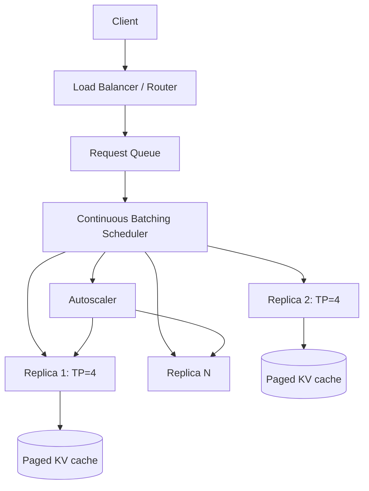

# Design an LLM Serving System

**The prompt:** "Design the inference serving layer for a chat product with 5 million
daily active users, using a 70B-parameter open-weight model."

## Clarifying questions

1. **Latency target** — is this streaming chat (time-to-first-token matters most) or
   batch/offline (throughput matters most)? *Assume: streaming chat, TTFT is the
   user-facing metric.*
2. **Traffic pattern** — steady or peaky, and what's the peak-to-average ratio?
   *Assume: 5M DAU, ~15 messages/user/day, strongly peaked around evenings (3x average).*
3. **Model fixed or evolving** — one static model, or frequent fine-tune/version
   rollouts? *Assume: a small number of model versions (base + 2-3 fine-tunes) served
   concurrently, with rollouts every few weeks.*
4. **Cost constraints** — is this cost-sensitive (optimize $/token) or latency-first
   regardless of cost? *Assume: cost-sensitive — GPU spend is the largest infra line
   item, so utilization matters as much as latency.*
5. **Context length distribution** — mostly short chat turns, or long documents/context
   sometimes? *Assume: mostly short (avg 500 input tokens), with a long tail up to 8K.*
6. **On-prem/self-hosted GPUs or a managed inference API?** *Assume: self-hosted GPU
   fleet — this is what makes the serving-layer design questions (batching, KV cache
   memory management) the actual crux of the problem.*

## Requirements

**Functional:** streaming token generation; support multiple concurrently-served model
versions; graceful handling of long-tail long-context requests without starving
short-request latency.

**Non-functional:** p95 time-to-first-token < 500ms at peak; maximize GPU throughput
(tokens/sec/GPU) to control cost; no single slow request should block others (fairness
across concurrent requests).

**Back-of-envelope numbers:**

| Quantity | Estimate |
|---|---|
| DAU × messages/day | 5M × 15 = 75M messages/day |
| Peak QPS (3x average, spread over ~12 active hours) | ~75M / (12×3600) × 3 ≈ ~5,200 QPS |
| Avg input tokens | 500 |
| Avg output tokens | 300 |
| 70B model, bf16 weights | ~140 GB just for weights — requires multi-GPU (tensor parallel) per replica |

The weight size alone (~140GB in bf16) means a single request needs a multi-GPU replica
(e.g. 2-4x 80GB GPUs with tensor parallelism) before you've even accounted for KV cache
memory — that's the first hard constraint shaping the whole design.

## High-level architecture



- **Router** — routes by model version (multiple concurrently-served versions), sticky
  enough for cache-friendly routing where relevant but otherwise load-balances by current
  replica queue depth, not round-robin (round-robin ignores that requests have very
  different generation lengths).
- **Continuous batching scheduler** — the core throughput lever (see deep dive):
  dynamically adds/removes requests from an in-flight batch at each decode step, instead
  of static batching that waits for a fixed batch to fill.
- **Replicas with tensor parallelism** — each replica shards the 70B model across
  multiple GPUs (weights don't fit on one) and uses paged KV-cache allocation to avoid
  memory fragmentation from variable-length sequences.
- **Autoscaler** — scales replica count on queue depth / GPU utilization, with headroom
  for the evening peak, not average load.

## Deep dive: continuous batching and the KV cache

Static batching (wait for N requests, run them together, return all N when the longest
finishes) wastes GPU cycles — a batch of 8 requests with generation lengths
[50, 500, 500, 500, 500, 500, 500, 500] leaves 7 GPU slots computing padding/idle for
most of that batch's lifetime once the 50-token request finishes early. Continuous
batching (used by vLLM, TGI, and similar serving stacks) instead treats each decode step
as an opportunity to add newly-arrived requests and remove newly-completed ones from the
running batch — the GPU is doing useful work for every slot at every step, which is the
single biggest throughput lever in modern LLM serving.

This requires the KV cache to be managed dynamically rather than pre-allocated per
sequence at a fixed max length — PagedAttention-style allocation manages the KV cache in
fixed-size blocks (like OS virtual memory pages) so sequences of very different lengths
don't force worst-case memory reservation per sequence, and memory can be reclaimed
immediately when a sequence finishes rather than held for the batch's lifetime. Combined,
continuous batching + paged KV cache is what makes it possible to serve the peaky,
variable-length traffic pattern (500 avg input, tail up to 8K) without either massively
over-provisioning memory or under-utilizing GPU compute.

## Deep dive: fairness under mixed short/long requests

Without explicit handling, a batch of mostly-short chat requests can get stuck behind a
few long-context (8K-token) requests, because the scheduler processes the batch in
lockstep per decode step and a long prefill (processing the long request's initial
context) can dominate a step's compute. Mitigations: separate prefill and decode into
different scheduling priorities (some serving stacks disaggregate prefill and decode onto
different GPU pools entirely, since prefill is compute-bound and decode is
memory-bandwidth-bound — see [LLM Fundamentals Q3](questions-llm-fundamentals.md)), and
apply a max-tokens-per-prefill-step cap so one large request's prefill is chunked across
multiple steps instead of monopolizing a step, keeping TTFT bounded for concurrently
arriving short requests.

## Tradeoffs

| Decision | Option A | Option B | Chosen | Why |
|---|---|---|---|---|
| Batching strategy | Static batching | Continuous batching | Continuous | Static batching wastes GPU cycles once shorter requests in the batch finish early |
| Attention config | Full MHA | Grouped-query attention (GQA) | GQA | 70B-scale decode throughput is memory-bandwidth-bound on KV cache size — GQA shrinks it with minimal quality loss (see [LLM Fundamentals Q7](questions-llm-fundamentals.md)) |
| Prefill/decode scheduling | Combined, lockstep | Chunked prefill / separate priority | Chunked | Prevents long-context requests from starving TTFT for concurrent short requests |
| Parallelism strategy | Data parallel replicas only | Tensor parallel within replica + data parallel across replicas | Both | 140GB weight size requires TP just to fit one replica; DP across replicas then scales throughput |

## Failure modes & mitigations

- **GPU OOM from KV cache growth under a traffic spike** — paged KV cache with a hard
  cap on total in-flight tokens; new requests queue (with a max queue-wait SLA) rather
  than being admitted and causing an OOM crash that drops the whole replica's in-flight
  requests.
- **A replica crashes mid-generation** — in-flight requests on that replica fail; client
  retry logic must be idempotent-safe (resuming a partial generation isn't generally
  possible, so the client re-sends the request, ideally to a different replica).
- **Autoscaler lag during a sudden traffic spike** — GPU replica cold-start (model load)
  takes minutes, far slower than autoscaling reaction time; mitigate with pre-warmed
  standby capacity sized for the known evening peak pattern, not purely reactive scaling.
- **New model version rollout causes a quality or latency regression** — canary rollout
  (route a small percentage of traffic to the new version) with automated eval gates
  (see [Evals & Production Q&A](questions-evals-production.md)) before full cutover.

## Deep dive: Serving Observability, Prometheus Metrics & Hardware Telemetry

```text
[Inference Gateway] ──> [vLLM Replica Engine (Tensor Parallel Shards)]
                                 │
   ┌─────────────────────────────┼─────────────────────────────┐
   ▼                             ▼                             ▼
[KV Cache Allocator]      [Continuous Scheduler]     [GPU Hardware Telemetry]
 ├─> Block Usage %        ├─> Prefill vs Decode      ├─> NVLink Bandwidth
 └─> Eviction Rate        └─> Batch Token Count      └─> GPU Compute Core %
```

### 1. Prometheus Metrics SLA Dashboard
- **Serving Performance Metrics**:
  - `llm_serving_time_to_first_token_seconds` (TTFT P50/P95/P99 latency).
  - `llm_serving_time_per_output_token_seconds` (TPOT decoding latency per token).
  - `llm_serving_tokens_per_second_total` (Throughput across prompt vs generation tokens).
- **GPU Engine Telemetry**:
  - `vllm_gpu_cache_usage_perc` (Paged KV-cache memory pressure).
  - `vllm_num_requests_waiting` (Queue depth metric for autoscaling triggers).
  - `vllm_prompt_tokens_per_second` vs `vllm_generation_tokens_per_second`.

### 2. Distributed OpenTelemetry Tracing
- **Span Hierarchy**:
  - `llm_serving.request` (Gateway request duration)
    - `llm_serving.prefill` (Chunked prefill execution on GPU core)
    - `llm_serving.decode` (Iterative decoding step loop)
    - `llm_serving.stream_chunk` (Token chunk dispatch latency to client)

### 3. Continuous Benchmarking & Evals
- **Synthetic Load Testing**: Daily automated execution of `vllm benchmark_serving` against replica pools under step-function QPS workloads to detect engine memory leaks or latency regressions.

## Likely follow-ups

- **"How does this change if you switch to a managed inference API instead of
  self-hosting?"** — Most of the batching/KV-cache/parallelism design moves to the
  provider's responsibility; your design shifts to request routing, rate-limit handling,
  multi-provider fallback for availability, and cost optimization via model
  tiering/caching rather than GPU-level scheduling.
- **"How would you reduce cost further without hurting latency?"** — Prompt/response
  caching for repeated queries, speculative decoding (a small draft model proposes
  tokens the large model verifies in parallel, reducing large-model forward passes),
  and quantization (e.g. int8/int4 weights) traded against a measured quality delta.
- **"How do you know your continuous batching setup is actually well-tuned?"** — Track
  GPU utilization (tokens/sec/GPU) and TTFT/total-latency percentiles together — high
  utilization with degraded tail latency means the fairness/chunking tuning needs work,
  not more raw throughput capacity.

## Key takeaways

- Model weight size alone can force multi-GPU tensor parallelism before any traffic
  modeling even starts — check this first.
- Continuous batching + paged KV cache allocation is the standard modern answer to "how
  do you maximize GPU utilization for variable-length generation," and interviewers
  expect you to know why static batching fails.
- Prefill is compute-bound and parallelizable; decode is memory-bandwidth-bound on the KV
  cache — this distinction drives most of the advanced scheduling decisions (chunked
  prefill, disaggregation, GQA).
- Fairness between short and long requests needs explicit scheduling policy, not just
  "add more GPUs."
- Cost optimization (caching, speculative decoding, quantization) is a separate lever
  from raw scaling — bring it up even if not explicitly asked, since cost-sensitivity was
  in the requirements.
