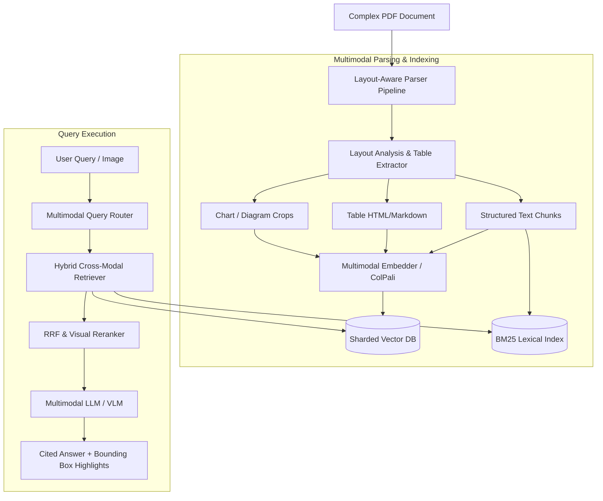

# Design an Enterprise Multimodal RAG System

**The prompt:** "Design an enterprise RAG system capable of accurately processing 10 million complex financial/technical PDF documents containing multi-column text, dense data tables, architecture diagrams, and charts."

---

## 1. Clarifying Questions

1. **Document Types** — What documents are in the corpus? *Financial reports (10-K/10-Q), technical manuals, medical papers with charts and dense tables.*
2. **Modalities** — Are queries text-only or multimodal? *Queries are text-based or visual (e.g. user uploads a diagram and asks "Explain this circuit layout").*
3. **Scale & Ingestion Volume** — How many pages total? *10M documents $\times$ avg 30 pages = 300 million pages.*
4. **Accuracy Bar** — What happens if a table cell value is retrieved wrong? *High financial impact — tabular data extractions must be 100% precise without table row alignment corruption.*

---

## 2. Requirements & Capacity Sizing

### Functional Requirements
- Multi-modal document parser (extracting text, tables as Markdown/HTML, and chart images with visual bounding boxes).
- Cross-modal hybrid indexing (Text vector + Visual embeddings via ColPali / CLIP + BM25 keyword index).
- Visual citation highlighting (returning precise page bounding box coordinates for source figures/tables).

### Non-Functional & Storage Estimates
- **Total Pages**: 300 million pages.
- **Visual Page Rendering Storage**: 300M pages $\times$ 150 KB compressed JPEG = **45 TB visual page cache**.
- **Vector Storage**: 300M pages $\times$ 1024-dim embedding = **1.2 TB raw vector index**.

---

## 3. High-Level Architecture



---

## 4. Deep Dives

### A. Document Layout Parsing: Text Extraction vs. ColPali Visual Embeddings
- **Traditional OCR + Parser (e.g. Unstructured / Marker)**: Converts tables to Markdown. Breaks on complex multi-column layouts or merged table cells.
- **Vision-Language Retriever (ColPali)**: Embeds the entire visual page directly using a Vision LLM patch encoder (PaliGemma). Preserves visual layout, font hierarchy, and chart graphics naturally without parsing loss.

```python
# Processing page image directly via ColPali vision patch embedder
def embed_document_page(page_image):
    patches = vision_patch_encoder(page_image)
    page_embeddings = colpali_model(patches)
    return page_embeddings
```

### B. Table & Chart Extraction Strategy
- Tables are extracted into structured HTML `<table>` tags and indexed alongside a high-resolution PNG rendering of the table.
- Charts and diagrams are processed through a Vision-Language Model to generate dense textual descriptions (e.g. "Line chart showing revenue growth from Q1 to Q4 2025").

---

## 5. Observability, Tracing, Metrics & Vision Evals

```text
[User Multimodal Query] ──> [Multimodal Gateway Span]
                                   │
         ┌─────────────────────────┼─────────────────────────┐
         ▼                         ▼                         ▼
[ColPali Visual ANN Span]  [Table HTML Search Span]  [VLM Generation Span]
 ├─> Patch Embeddings       ├─> Structure Match       ├─> Visual Tokens
 └─> Image Cache Hit        └─> Cell Alignment        └─> Grounding Box Eval
```

### A. Distributed Tracing (OpenTelemetry)
- **Span Hierarchy**:
  - `multimodal_rag.query` (Root query span)
    - `multimodal_rag.retrieval` (ColPali visual vector search + text BM25)
    - `multimodal_rag.rerank` (Visual cross-encoder scoring)
    - `multimodal_rag.vlm_generation` (Vision-Language model latency, TTFT, token usage)

### B. Prometheus Metrics & SLAs
- **Multimodal Performance Metrics**:
  - `multimodal_rag_chart_extraction_accuracy` (% correctly grounded chart answers).
  - `multimodal_rag_table_cell_precision` (% precision on numeric tabular lookups).
  - `multimodal_rag_page_image_fetch_latency_seconds`.

### C. Vision Evals
- **Visual Grounding Benchmark**: Test suite evaluating whether generated answers cite the correct visual bounding boxes (`[ymin, xmin, ymax, xmax]`) on complex schematics.

---

## 6. Architectural Tradeoffs

| Decision | Option A | Option B | Chosen | Why |
|---|---|---|---|---|
| Ingestion Strategy | Pure Text OCR | Vision-Based ColPali Embeddings | Hybrid (ColPali + Table HTML) | Direct vision embeddings preserve table alignment while HTML enables exact keyword search. |
| Model Choice | Standard Text LLM | Multimodal Vision LLM (VLM) | Vision LLM | VLM is mandatory to reason over diagrams, graphs, and visual context. |

---

## 7. Key Takeaways

- Enterprise documents with complex layouts require **vision-aware indexing (ColPali)** rather than flat OCR text splitting.
- Tables should be parsed as **structured HTML and paired with visual page image crops**.
- Observability requires tracking **bounding box grounding precision** and **multimodal retrieval latency**.
