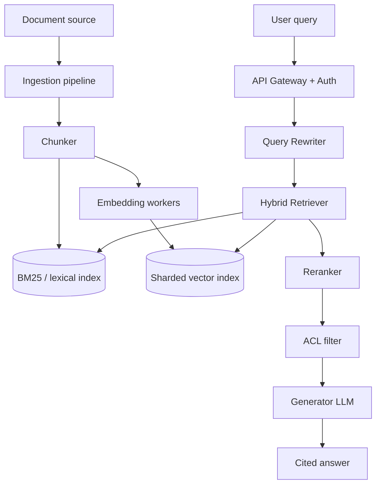

# Design a RAG System

**The prompt:** "Design a system that lets employees ask natural-language questions
over a 50-million-document legal/compliance corpus and get accurate, cited answers."

## Clarifying questions

A strong candidate asks these before drawing anything:

1. **Scale** — 50M documents, but how big is each (a page? a 200-page contract)? What's
   total corpus size in tokens/GB? *Assume: avg 20 pages/doc, ~800M total pages.*
2. **Query volume** — how many queries/day, and what's the concurrency pattern (steady
   or bursty)? *Assume: 200K queries/day, business-hours bursty, peak ~50 QPS.*
3. **Latency budget** — what's acceptable end-to-end response time? *Assume: p95 < 3s
   for a first token, full answer within 8s.*
4. **Update frequency** — is the corpus static or constantly changing? *Assume: ~5,000
   new/updated documents per day.*
5. **Accuracy requirements** — is this advisory (a lawyer reviews the answer) or
   high-stakes (directly relied upon)? *Assume: advisory, but hallucination + citation
   accuracy still matter a lot — wrong-but-confident answers erode trust fast in this
   domain.*
6. **Access control** — do all employees see all documents, or is there permission
   scoping (e.g. by client matter)? *Assume: yes, per-document ACLs must be enforced at
   retrieval time.*

## Requirements

**Functional:** natural-language query → retrieved, cited answer; support follow-up
questions in a session; respect document-level access control.

**Non-functional:** p95 first-token < 3s; support 50 QPS peak; incremental ingestion
(no full reindex) for daily updates; retrieval must not leak documents outside the
requester's ACL scope.

**Back-of-envelope numbers:**

| Quantity | Estimate |
|---|---|
| Total pages | ~800M pages × ~500 words/page ≈ 400B words |
| Chunks (≈250 words/chunk, structure-aware) | ~1.6B chunks |
| Embedding dim (e.g. 1024) × 4 bytes | ~6.4 TB raw vector storage (before index overhead) |
| Peak QPS | 50 |
| Daily ingestion | 5,000 docs × ~40 chunks/doc ≈ 200K chunk upserts/day |

That vector storage number is the first real design constraint — it rules out a naive
"one flat index" approach and pushes toward a sharded, disk-backed ANN index (e.g. IVF or
DiskANN-style) rather than an all-in-memory HNSW index sized for a much smaller corpus.

## High-level architecture

- **Ingestion pipeline** — structure-aware chunker (splits on clause/section boundaries
  for legal docs, not fixed-size windows), embedding workers (batched, GPU-backed),
  writes to both the vector index and the lexical (BM25) index, tagged with ACL
  metadata per chunk.
- **Query rewriter** — expands/clarifies the raw query (e.g. resolves pronouns using
  session history for follow-ups) before retrieval.
- **Hybrid retriever** — queries both indexes in parallel, merges via reciprocal rank
  fusion.
- **Reranker** — cross-encoder over the top ~50 hybrid candidates, cuts to top ~8.
- **ACL filter** — applied *before* generation (and ideally as a filter pushed into the
  vector search itself, not post-hoc, so an under-fetch doesn't leak — see deep dive).
- **Generator** — LLM producing the answer with inline citations back to source chunks.

## Deep dive: ACL-aware retrieval at scale

The naive approach — retrieve top-k globally, then filter out documents the user can't
see — is broken: if the true top-8 relevant chunks are all outside the user's ACL scope,
post-hoc filtering returns nothing useful even though relevant *accessible* documents
exist further down the ranking. The system needs to fetch more candidates than needed and
filter progressively, or push the ACL filter into the retrieval step itself.

The scalable approach: attach an ACL group id (or bitset) to each chunk's vector-index
metadata, and use the vector DB's native metadata filtering (most modern vector DBs
support pre-filtering, not just post-filtering) so the ANN search itself only considers
chunks the requester can access. This avoids the "filtered down to nothing" failure and
avoids wasting retrieval budget on inaccessible chunks. The cost: metadata-filtered ANN
search is typically slower than unfiltered search (fewer candidates satisfy the filter at
each level of the index), so this needs to be load-tested at realistic ACL-group
cardinality, not just benchmarked unfiltered.

## Deep dive: incremental ingestion without full reindex

At 200K chunk upserts/day against a 1.6B-chunk index, a full reindex is infeasible.
Instead: each chunk gets a stable ID (`doc_id::chunk_index::version`), and updates are
upserts by ID — the vector DB replaces the old vector, and a background job purges
orphaned chunk IDs (from documents whose chunk boundaries shifted) using a per-document
`content_hash` check. Embedding computation is decoupled from the index write via a
queue, so ingestion bursts (e.g. a batch upload of 500 new documents) don't block query
serving or cause write contention on the index.

## Tradeoffs

| Decision | Option A | Option B | Chosen | Why |
|---|---|---|---|---|
| Retrieval strategy | Pure vector | Hybrid (BM25 + vector) | Hybrid | Legal queries include exact citation/clause-number lookups that embeddings handle poorly (see [RAG Q&A](questions-rag.md)) |
| Chunking | Fixed-size | Structure-aware (clause/section) | Structure-aware | Legal clauses reference definitions that must stay together for correct interpretation |
| ACL enforcement | Post-hoc filter | Pushed into ANN pre-filter | Pre-filter | Post-hoc filtering can return empty results when top-k is dominated by inaccessible docs |
| Reindex strategy | Full periodic reindex | Incremental upsert by stable chunk ID | Incremental | 5K docs/day against 50M docs makes full reindex cost-prohibitive and introduces staleness windows |

## Failure modes & mitigations

- **Vector DB shard unavailable** — replicate shards, serve degraded (BM25-only) results
  with a "reduced confidence" flag rather than a hard failure.
- **Embedding service latency spike** — ingestion queues absorb backpressure; query-time
  embedding (for the user's query) has a strict timeout with a lexical-only fallback.
- **Reranker cross-encoder overload at peak QPS** — cap candidates reranked (fixed k),
  and autoscale the reranker service independently from the retriever.
- **Stale ACL after a permission change** — ACL metadata must be re-synced on permission
  change events, not just at ingestion time, or a revoked user retains retrieval access
  until the next full sync — treat ACL sync as a real-time event stream, not a batch job.

## Likely follow-ups

- **"How does this change at 10x scale (500M documents)?"** — Sharding strategy becomes
  the primary lever: partition the vector index by a stable dimension (e.g. document
  category or client) so most queries only search a relevant shard subset, not the whole
  10x-larger index; re-evaluate whether a single hybrid retriever process can still meet
  latency or whether retrieval itself needs to fan out and merge across shard-local
  retrievers.
- **"How do you evaluate answer quality in production?"** — A faithfulness/citation
  accuracy eval (see [Evals & Production Q&A](questions-evals-production.md)) run
  continuously against a sampled query log, plus human spot-review on a stratified sample
  given the advisory/high-trust domain.
- **"What if the corpus needs sub-second, not 3-second, latency?"** — Would require
  pre-computing and caching answers for common query patterns, a smaller/faster reranker
  or skipping reranking for high-confidence retrievals, and likely a smaller, more
  aggressively quantized generator model — each of those is a real quality tradeoff, not
  a free win.

## Key takeaways

- Back-of-envelope storage math should happen *before* picking an index architecture —
  it's what rules out naive approaches.
- Hybrid search beats pure vector search whenever the query distribution includes
  exact-match needs (IDs, citations, terminology).
- ACL enforcement must be pre-filter, not post-filter, or you get silent empty-result
  failures for legitimately scoped users.
- Incremental upsert by stable chunk ID is what makes daily ingestion tractable at scale
  — full reindexing does not scale with corpus size.
- Every "chosen" architecture decision should have a stated "why not the alternative" —
  that's what's actually being evaluated in the interview.
