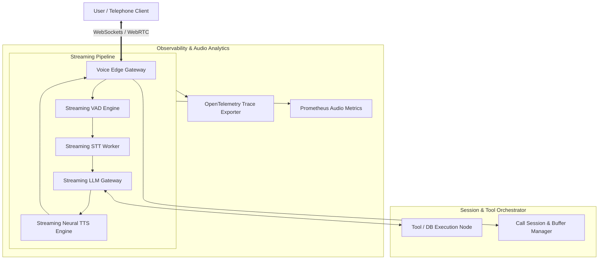

# Design a Real-Time Voice AI Agent Platform

**The prompt:** "Design a real-time voice AI assistant (like OpenAI Voice Mode or Retell AI) that conducts natural, full-duplex conversational telephone/web audio interactions with sub-500ms latency, turn-taking detection, and live tool execution."

---

## 1. Clarifying Questions

1. **Latency Budget** — What is human-perceived conversational latency? *Target: End-to-end response time under 500ms (speech stop to audio output start).*
2. **Concurrency & Scale** — How many active simultaneous calls? *Assume: 10,000 concurrent voice calls at peak.*
3. **Network Protocol** — WebRTC, WebSockets, or SIP? *Assume: WebSockets / WebRTC for browser and SIP/RTP gateways for telephony (Twilio/Plivo).*
4. **Full-Duplex & Interruption (Barge-in)** — Can the user cut off the agent mid-sentence? *Assume: Yes, instant barge-in detection is required.*
5. **Tool Execution** — Can the voice agent look up accounts or execute actions mid-call? *Assume: Yes, sub-200ms tool lookups while streaming filler tokens ("Let me check that for you...").*

---

## 2. Requirements & Capacity Sizing

### Functional Requirements
- High-fidelity full-duplex audio stream (WebSocket / WebRTC).
- Sub-500ms end-to-end latency pipeline: Voice Activity Detection (VAD) $\rightarrow$ Speech-to-Text (STT) $\rightarrow$ LLM Reasoning $\rightarrow$ Text-to-Speech (TTS).
- Barge-in handling (user speaking immediately cancels in-flight TTS generation and audio queue).
- Low-latency tool invocation with conversational placeholder streaming.

### Non-Functional Requirements & Sizing
- **Audio Bitrate**: 16kHz PCM mono audio = 256 kbps bidirectional stream per call.
- **Network Throughput**: 10,000 calls $\times$ 256 kbps $\approx$ 2.56 Gbps bandwidth.
- **Latency Budget Allocation**:
  - Voice Activity Detection (VAD): **30ms**
  - Streaming STT (e.g. Whisper / Deepgram): **100ms**
  - LLM Time to First Token (TTFT): **150ms**
  - Streaming TTS (e.g. ElevenLabs / Cartesia): **120ms**
  - Audio Network Buffer & Playback: **50ms**
  - **Total Pipeline Latency: 450ms**

---

## 3. High-Level Architecture



---

## 4. Deep Dives

### A. Turn-Taking, VAD & Low-Latency Interruption (Barge-in)
- **Silero VAD**: Evaluates 30ms audio frames on the streaming server.
- **Barge-in Execution Logic**:
  1. User speaks while TTS is playing $\rightarrow$ VAD triggers `SPEECH_STARTED` within 40ms.
  2. Gateway emits cancellation signal to LLM generator and TTS worker stream.
  3. Client flushes local playback buffer immediately.
  4. Previous response generation is aborted, retaining full conversation context up to the interruption index.

```python
async def handle_audio_stream(websocket, session):
    async for audio_chunk in websocket:
        is_speech = vad.process_frame(audio_chunk)
        if is_speech and session.is_agent_speaking:
            # User interrupted agent -> Abort in-flight generation
            await session.cancel_agent_output()
            await websocket.send_json({"type": "clear_audio_buffer"})
            session.is_agent_speaking = False
            
        if is_speech:
            stt_stream.write(audio_chunk)
```

### B. Speech-to-Speech vs Cascade (STT + LLM + TTS) Model Tradeoffs
- **Cascade Model (STT $\rightarrow$ LLM $\rightarrow$ TTS)**: High modularity, allows selecting best-in-class specialized models, easier tool integration, but incurs cumulative latency across boundaries.
- **End-to-End Direct Speech-to-Speech (e.g. GPT-4o voice)**: Lowest latency and captures emotional prosody, but harder to sandbox and attach custom function tools without fine-tuning.

---

## 5. Observability, Tracing, Metrics & Voice Evals

```
[WebSocket Frame] ──> [Voice Edge Span]
                             │
         ┌───────────────────┼───────────────────┐
         ▼                   ▼                   ▼
[STT Chunk Latency]  [LLM TTFT Span]     [TTS Chunk Latency]
 ├─> Transcription    ├─> Reasoning       ├─> First Audio Chunk
 └─> Confidence       └─> Token Stream    └─> Audio Duration
```

### A. OpenTelemetry Audio Span Tracing
- **Trace Propagation**: Maintain trace IDs across WebSocket binary audio frames and RPC calls.
- **Span Hierarchy**:
  - `voice.turn` (Whole conversational turn)
    - `voice.vad` (Speech start/end detection window)
    - `voice.stt` (Final transcript stability latency)
    - `voice.llm_ttft` (Time to first LLM response token)
    - `voice.tts_first_chunk` (Audio generation latency)

### B. Prometheus Voice SLAs
- **Voice Performance Metrics**:
  - `voice_turn_around_time_seconds` (Target: P95 < 500ms).
  - `voice_bargein_cancellation_latency_ms` (Target < 100ms).
  - `voice_jitter_buffer_underruns_total` (Audio packet drop rate).

### C. Continuous Audio Evals
- **Speech Clarity & Intelligibility Evals**: Continuous Word Error Rate (WER) scoring on speech-to-text transcripts.
- **Groundedness & Safety Evals**: Real-time evaluation of generated conversational responses against compliance guidelines.

---

## 6. Architectural Tradeoffs

| Decision | Option A | Option B | Chosen | Why |
|---|---|---|---|---|
| Protocol | HTTP Streaming | WebSockets / WebRTC | WebSockets / WebRTC | Low overhead full-duplex binary audio transport. |
| VAD Engine | Energy-threshold VAD | Deep Learning Silero VAD | Silero VAD | Robust against background noise in mobile/phone environments. |
| Model Stack | Pure End-to-End S2S | Cascade (STT + LLM + TTS) | Cascade with Chunking | Allows fine-grained tool integration and custom neural voice selection. |

---

## 7. Key Takeaways

- Voice AI latency is governed by **pipeline chunking**: streaming tokens directly into TTS as soon as 3–5 tokens form a sentence clause.
- Interruption management requires **immediate client-side audio buffer flushing** upon VAD speech detection.
- Monitoring requires sub-500ms total SLA tracking with OpenTelemetry audio spans.
