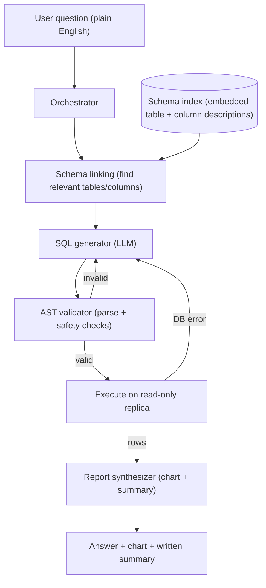

# Design a Text-to-SQL Data Analyst Agent

**The prompt:** "Design a system that lets a non-technical person ask a plain-English
question about company data (for example, 'Which 5 products made the most revenue last
quarter?') and get back a correct answer, a chart, and a short written summary, without
ever writing SQL themselves."

Before we start, two words we will use throughout:

- **Text-to-SQL** just means turning a plain-English question into a database query (SQL)
  that a database can run.
- **Schema** is the list of tables and columns in a database. Our running example uses a
  tiny one: a `products` table (columns `product_id`, `name`, `category`, `unit_price`)
  and an `orders` table (columns `order_id`, `product_id`, `quantity`, `unit_price`,
  `order_date`).

We will carry that one question and that one schema through the whole design, so every
abstract step has a concrete instance sitting next to it.

## Clarifying questions

A strong candidate asks these before drawing anything, because the answers change the
design:

1. **Who asks the questions, and how many?** Internal analysts and managers, or millions
   of public users? *Assume: about 500 internal employees, roughly 2,000 questions per
   day, peak around 5 questions per second. This is an internal tool, not a public
   product, which relaxes latency but raises the bar on trust.*
2. **How big is the schema?** A handful of tables or a full warehouse? *Assume: about 300
   tables and 6,000 columns across the warehouse. This single number, as we will see,
   forces the most important design decision.*
3. **What latency is acceptable?** *Assume: an analytical answer within about 10 seconds
   is fine. People expect thinking, not instant autocomplete.*
4. **How correct must it be?** *Assume: advisory. A human reads the answer before acting,
   but a confidently wrong number erodes trust fast, so correctness still matters a lot.*
5. **Can the agent touch production data?** *Assume: no. It may only read, never write,
   and it must not slow down the real database that the business runs on.*
6. **One database or many?** *Assume: start with one SQL warehouse (say PostgreSQL), but
   keep the door open for more later.*

## Requirements

**Functional:** take a plain-English question, find the right tables and columns, generate
correct SQL for the target database, run it safely, and return three things: the answer
rows, a chart, and a short written summary.

**Non-functional:** never modify data; never run a query that could overload the database;
recover automatically from fixable mistakes; and answer within about 10 seconds for a
typical question.

**Back-of-envelope numbers.** These motivate the architecture, so we do them first:

| Quantity | Estimate | Why it matters |
|---|---|---|
| Columns in the warehouse | ~6,000 | If we dumped the whole schema into the prompt it would be tens of thousands of tokens, which is expensive and drowns the model in irrelevant columns |
| Columns actually needed per question | usually 3 to 8 | Our example needs only `name`, `quantity`, `unit_price`, `product_id`, `order_date` |
| Peak load | ~5 questions per second | Small, so a single well-designed pipeline handles it |
| Execution timeout on the database | 30 seconds hard cap | A safety limit so no single query can run forever |

The first row is the whole ballgame. A model cannot see 6,000 columns and reliably pick
the right 5. That is why the first real component is not the SQL generator, it is the part
that narrows 6,000 columns down to the few that matter.

## High-level architecture



Walking through each box and why it is there:

- **Orchestrator** is the controller that runs the steps in order and counts retries. It
  is the loop, not the brain.
- **Schema linking** is the step that matches words in the question to the right tables
  and columns. "revenue" is not a column in our schema, so this step has to know that
  revenue is `quantity` times `unit_price`, and that "products" maps to the `products`
  table. It works by embedding (turning into a vector of numbers) every table and column
  description ahead of time, then retrieving the closest matches to the question. This
  keeps the prompt small, which is exactly what the numbers table demanded. This is
  pillar 1, schema linking and ingestion.
- **SQL generator** is an LLM (large language model) call that, given the small linked
  schema and the question, writes a candidate query in the target database's **dialect**
  (the specific SQL flavor a database speaks; PostgreSQL, MySQL, and BigQuery differ in
  small ways like date functions).
- **AST validator** checks the generated SQL before it runs. AST stands for abstract
  syntax tree, which is just SQL parsed into a structured form a program can inspect,
  instead of raw text. This is pillar 2.
- **Read-only replica** is a read-only copy of the production database. Running here means
  a query can never change data or slow the real system. This is where pillar 3, the
  self-correction execution loop, happens.
- **Report synthesizer** turns the result rows into a chart and a plain-English summary.
  This is pillar 4.

For our example, schema linking returns the two relevant tables, the generator writes a
query, and the expected correct SQL looks like this:

```sql
SELECT p.name, SUM(o.quantity * o.unit_price) AS revenue
FROM orders o
JOIN products p ON p.product_id = o.product_id
WHERE o.order_date >= '2026-04-01' AND o.order_date < '2026-07-01'
GROUP BY p.name
ORDER BY revenue DESC
LIMIT 5;
```

The revenue idea the model had to encode is simply, per row, quantity times price, summed
per product:

\[ \text{revenue}_{\text{product}} = \sum_{i} q_i \times p_i \]

## Deep dive: SQL generation and AST validation

This is the part that keeps the system honest. The generator is helpful but not
trustworthy, so we never run its text directly. We parse it first.

Once we have candidate SQL, a parser (for example the `sqlglot` library) turns it into an
AST. Walking that tree lets us check three things that plain text matching cannot check
reliably:

- **Every table and column is real.** We compare the AST's referenced names against the
  actual database catalog. If the model invented a `revenue` column instead of computing
  `quantity * unit_price`, we catch it here and send it back to be fixed.
- **The query is read-only.** We allow only `SELECT`. Any `INSERT`, `UPDATE`, `DELETE`, or
  `DROP` is rejected outright, so a bad generation can never damage data.
- **The query is bounded.** We require a `LIMIT` (or add one), so a question cannot
  accidentally pull back ten million rows.

!!! note "Why not just search the SQL string for the word DELETE?"
    Because string matching is fragile. A column could legitimately be named
    `deleted_at`, and an alias or a comment could hide a real problem. A parser
    understands structure, so it knows the difference between a table named `orders` and
    the word "orders" appearing inside a string. Structure beats substring matching every
    time here.

## Deep dive: the self-correction execution loop

Now the validated query runs on the read-only replica, and this is where most real systems
either shine or spin out of control.

Two very different kinds of errors can happen, and they need different handling:

- **Errors the database tells us about.** A wrong column name, a type mismatch, or a
  syntax slip. The database returns an error message. We feed that exact message back to
  the generator with the instruction "your query failed with this error, fix it," and try
  again. In practice this fixes most mistakes on the first or second retry, because the
  error message is precise.
- **Errors the database does not tell us about.** The query runs fine but answers the
  wrong question. For example it sums `quantity` instead of revenue, or it uses the wrong
  three months for "last quarter." The database is perfectly happy; the answer is just
  wrong.

The first kind is easy and is what the loop handles directly. The orchestrator caps
retries at a small fixed number (say 3). Without a cap, a stubborn error would loop
forever and burn money. After the cap, the agent stops and says clearly that it could not
answer, which is far better than guessing.

The second kind is the genuinely hard part of text-to-SQL, and no retry loop fixes it on
its own. We reduce it by showing the model a few sample result rows and asking it to check
them against the original question, and by having the agent state its assumptions in the
final report (see the ambiguity note below). We measure it, rather than assume it away,
with evaluation, covered in the follow-ups.

```text
question ─► generate SQL ─► AST valid? ─no─► regenerate (retry count + 1)
                                │yes
                                ▼
                        run on read replica
                                │
                 ┌──────────────┴───────────────┐
              DB error                         rows returned
                 │                                  │
        retries left? ─yes─► feed error back        ▼
                 │no                          sample-row self-check ─► report
                 ▼
        stop, report "could not answer"
```

## Tradeoffs

| Decision | Option A | Option B | Chosen | Why |
|---|---|---|---|---|
| Schema in the prompt | Send the whole schema | Schema linking (retrieve the relevant subset) | Schema linking | 6,000 columns will not fit in a prompt and dilute the model's attention; the question only needs a few |
| Trusting the SQL | Run the model's text directly | Parse to an AST and validate first | Validate first | It is the only reliable way to guarantee read-only, real columns, and a bounded result |
| Fixing errors | One shot, fail if wrong | Bounded self-correction loop | Bounded loop | Recovers from common fixable errors without the infinite-cost risk of an uncapped loop |
| Where to run | Production database | Read-only replica | Read-only replica | Isolation and safety: a bad query cannot change data or slow the business |

## Failure modes and mitigations

- **Hallucinated column.** The model invents a column that does not exist, like a ready
  made `revenue` field. The AST validator compares against the real catalog and rejects
  it, and the loop asks for a fix using only real columns.
- **Runaway or expensive query.** A query with no filter that scans the entire table. We
  enforce a `LIMIT`, set a 30-second statement timeout on the database, and can run the
  database's `EXPLAIN` (a cost estimate) first, refusing to execute if the estimated rows
  scanned are above a threshold.
- **Destructive or injected statements.** Anything that tries to write or drop data. Three
  independent guards stop this: the read-only replica, the AST allowlist that permits only
  `SELECT`, and a database user account that has read-only permissions in the first place.
- **Ambiguous question.** "Last quarter" could mean calendar or fiscal, and "revenue"
  could mean gross or net. The agent picks the most common interpretation and states that
  assumption in plain language in the report, so a human can correct it.

!!! warning "Defense in depth, not one lock"
    Do not rely on a single safety check. A prompt instruction telling the model "only
    read data" is the weakest guard, because the model can ignore it. The AST allowlist is
    stronger, and a read-only database account is strongest because it does not depend on
    the model behaving. Use all three together.

## Likely follow-up questions

- **"How do you turn the rows into a chart and a summary?"** This is pillar 4. After we
  have result rows, a second, separate LLM call generates a small piece of Python (using
  pandas and a plotting library) to draw the chart, plus a one-paragraph written summary
  of the finding. The chart code runs in a sandbox (an isolated environment with no file
  or network access), because running model-written code carries the same "do not trust it
  blindly" rule as SQL. Keeping this step separate from query generation keeps each step
  simple and each safety boundary clean.
- **"How do you know it is actually correct in production?"** The standard measure is
  execution accuracy: run the generated SQL and a human-written gold query on the same
  data and check whether they return the same rows, scored against a labeled benchmark
  (the Spider dataset is the common public one). In production, also log the retry count
  per question and collect thumbs up or down from users, then review the questions that
  needed the most retries. See the [Evals and Production Q&A](questions-evals-production.md).
- **"How does this scale to many databases?"** Give each database its own schema index,
  and add a first routing step that decides which database a question is about before
  schema linking runs. The core loop does not change; you are just choosing the right
  schema to link against. The agent-loop and orchestration ideas here connect to the
  [Agents Q&A](questions-agents.md) and the [Design an Agent Platform](design-agent-platform.md)
  case study.

## Key takeaways

- Schema linking is the core trick. You retrieve only the few tables and columns a
  question needs, because real warehouses have thousands of columns that cannot fit in a
  prompt and would only confuse the model.
- Never trust generated SQL as text. Parse it into an AST so you can prove it is
  read-only, references only real columns, and carries a `LIMIT` before it touches a
  database.
- Run everything on a read-only replica with a statement timeout, so a bad query can
  neither change data nor take the warehouse down.
- A bounded self-correction loop, feeding the database's own error message back and
  retrying a fixed number of times, recovers from most syntax and schema mistakes without
  risking runaway cost.
- Valid-but-wrong SQL is the hard failure, not syntax errors. Catch it with sample-row
  checks, stated assumptions, and execution-accuracy evaluation against gold queries.
- Turning rows into a chart is a second, sandboxed code-generation step, kept separate
  from query generation so each part stays simple and safe.
