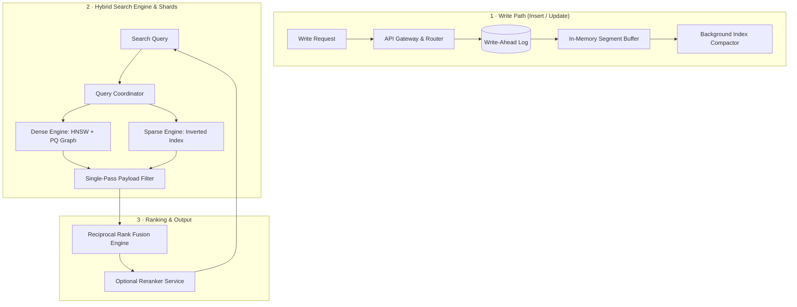

# Case Study: Design an Enterprise Hybrid Vector Search Engine

**The Prompt:** "Design a high-throughput, low-latency hybrid vector database (similar to Qdrant, Pinecone, or Milvus) that stores 1 billion 1536-dimensional vectors. The platform must support combined dense vector similarity and sparse keyword search (BM25/SPLADE), sub-50ms p95 latency, real-time incremental vector insertions, and multi-tenant payload filtering."

---

## 1. Clarifying Questions

1. **Dimensionality & Datatype** — What vector dimension and datatype are used?
   *Assume: 1536 dimensions (OpenAI / Cohere embeddings), float32 precision.*
2. **Read vs. Write Ratio** — What is the query vs indexing workload split?
   *Assume: Read-heavy (90% search queries, 10% incremental writes), peak 10,000 queries/sec.*
3. **Filtering & ACL** — Do searches require scalar metadata filtering?
   *Assume: Yes, strict multi-tenant filtering (e.g. `tenant_id == 'acme'` and `status == 'published'`).*
4. **Consistency Model** — Is immediate read-after-write required?
   *Assume: Eventual consistency (< 1s indexing lag for newly inserted vectors).*

---

## 2. Requirements & Back-of-Envelope Math

### Functional Requirements
- **Hybrid Search**: Combine Dense Similarity (Cosine / Inner Product) with Sparse Lexical (BM25) via Reciprocal Rank Fusion (RRF).
- **Metadata Filtering**: Single-pass payload filtering (filter vectors during graph traversal, not post-search).
- **Real-Time Insertions**: Support append-only logging for dynamic vector insertion without full index rebuilds.

### Non-Functional Requirements
- **Low Latency**: p95 search latency < 50ms over 1B vectors.
- **High Throughput**: Scale up to 10,000 queries/sec across clustered shards.
- **Memory Efficiency**: Compress 1B vectors to fit into reasonable RAM budgets using Product Quantization (PQ).

### Back-of-Envelope Math

| Metric | Calculation | Estimate |
|--------|-------------|----------|
| Raw Vector Storage | $1,000,000,000 \text{ vectors} \times 1536 \times 4 \text{ bytes}$ | **6.14 TB raw RAM** |
| Product Quantization (PQ16) | Compress 1536 floats to 64 bytes | **64 GB RAM** (96% memory reduction) |
| HNSW Graph Overhead | ~20-30% memory allocation for graph edges ($M=16$) | **~20 GB additional RAM** |
| Total Cluster Memory | PQ Vectors + HNSW Graph + Inverted Index | **~100 GB RAM Total** |

---

## 3. High-Level Architecture



---

## 4. Deep Dive: Key Subsystems

### A. Dense Indexing with HNSW + Product Quantization (PQ)
Raw 1536-dimensional vectors require massive RAM. The system uses **HNSW (Hierarchical Navigable Small World)** graphs combined with **Scalar / Product Quantization**:

\[
\vec{x} \approx \sum_{m=1}^{M} \mathbf{c}_{m, k_m}
\]

1. **Quantization**: Divide 1536 dimensions into 64 sub-vectors of size 24. Assign each sub-vector to its nearest cluster centroid codebook (64 bytes total per vector).
2. **Asymmetric Distance Computation (ADC)**: The query vector is kept in full uncompressed float32 precision, while dataset vectors are stored as PQ codes, computing sub-millisecond distance lookups via lookup tables.

### B. Single-Pass Payload Filtering
Standard "post-filtering" (top-k search $\rightarrow$ filter results) fails when metadata filter selectivity is high (e.g., matching 0.1% of dataset). The engine uses **Single-Pass Filtered HNSW Traversal**:

```python
def filtered_hnsw_search(query_vec, filter_expr, top_k, entry_node):
    visited = set()
    candidates = MinHeap()
    results = MaxHeap()
    
    candidates.push(entry_node)
    
    while candidates:
        curr = candidates.pop()
        
        # Check payload metadata condition BEFORE traversing neighbors
        if matches_filter(curr.payload, filter_expr):
            dist = compute_adc_distance(query_vec, curr.pq_code)
            results.push(dist, curr)
            if len(results) > top_k:
                results.pop_max()
                
        for neighbor in curr.neighbors:
            if neighbor not in visited:
                visited.add(neighbor)
                candidates.push(neighbor)
                
    return results
```

### C. Hybrid Search & Reciprocal Rank Fusion (RRF)
To combine dense semantic understanding with exact sparse keyword matching (e.g. part numbers, names):

\[
RRF\_Score(d) = \sum_{m \in \{\text{Dense}, \text{Sparse}\}} \frac{1}{k + r_m(d)}
\]

where $k = 60$ and $r_m(d)$ is the rank position of document $d$ in retrieval system $m$.

---

## 5. Architectural Trade-Offs

| Decision | Option A | Option B | Chosen | Why |
|----------|----------|----------|--------|-----|
| **Vector Storage** | Full Float32 Precision | Product Quantization (PQ) | PQ | Reduces RAM from 6TB to ~100GB with <2% recall loss. |
| **Filtered Search** | Post-filtering | Single-pass HNSW traversal | Single-pass | Eliminates empty result sets when metadata filter matching rate is low. |
| **Hybrid Scoring** | Convex Score Sum ($\alpha S_d + \beta S_s$) | Reciprocal Rank Fusion (RRF) | RRF | Robust across non-calibrated score distributions from dense vs sparse algorithms. |

---

## 6. Failure Modes & Mitigations

- **HNSW Graph Fragmentation on Deletes**:
  - *Risk*: High delete volumes leave orphan graph nodes, degrading search recall.
  - *Mitigation*: Soft deletes via tombstone bitmaps; background thread compacts and rebalances segment graphs when tombstone ratio exceeds 15%.
- **OOM during Parallel HNSW Construction**:
  - *Risk*: Indexing 1B vectors simultaneously causes RAM spikes.
  - *Mitigation*: Partition dataset into fixed 5M vector segments; build sub-graphs independently and memory-map completed segments (`mmap`).

---

## 7. Key Takeaways & Interview Summary

- **Memory Sizing**: Always calculate raw vs quantized memory footprint; PQ is non-negotiable for 1B vector scale.
- **Single-Pass Filtering**: Explain why post-filtering breaks under high selectivity, and walk through filtered graph traversal.
- **Hybrid Fusion**: Use Reciprocal Rank Fusion (RRF) to merge score distributions from dense HNSW graphs and sparse inverted indices.
