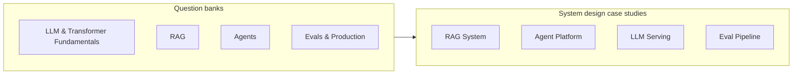

# Interview Prep & System Design

A **dedicated track** for the two things the rest of the handbook doesn't directly
prepare you for: getting *asked* about this material under interview pressure, and
designing a full AI system on a whiteboard in 45 minutes.

This track assumes you've worked through (or are working through) the core courses —
it drills the same material from an interviewer's angle, not a new curriculum.

## Question banks

Each page groups 6-10 questions by topic, tagged by level (`L1` screening, `L2`
mid-level, `L3` senior/staff). Every answer explains the reasoning and the likely
follow-up — not just the "correct" one-liner.

| Page | Covers |
|------|--------|
| [LLM & Transformer Fundamentals](questions-llm-fundamentals.md) | Attention, tokenization, training dynamics, sampling |
| [RAG](questions-rag.md) | Chunking, retrieval, reranking, hallucination |
| [Agents](questions-agents.md) | Tool use, memory, orchestration, failure handling |
| [Evals & Production](questions-evals-production.md) | Eval design, cost, latency, safety, incident response |

## System design case studies

Each case study walks the full interview process: clarifying questions → requirements →
architecture → deep dive → tradeoffs → failure modes → likely follow-ups. Read these
after the question banks — they assume the vocabulary the Q&A pages build.

| Page | System |
|------|--------|
| [Design a RAG System](design-rag-system.md) | Retrieval-augmented Q&A over a large private corpus |
| [Design an Agent Platform](design-agent-platform.md) | Multi-tenant platform running autonomous coding/support agents |
| [Design a Coding Agent & IDE Assistant](design-code-agent.md) | Autonomous coding assistant (Claude Code / Cursor style) with repo mapping and sandboxed edits |
| [Design an Agent Data Flywheel](design-agent-data-flywheel.md) | Self-improving agent telemetry, execution verification, and SFT/DPO pipeline |
| [Design an Enterprise Hybrid Vector Search Engine](design-vector-search-engine.md) | Sub-50ms HNSW + BM25 hybrid vector database for 1B vectors |
| [Design an AI Safety & Guardrails Gateway](design-ai-guardrails-gateway.md) | Sub-20ms streaming reverse proxy for PII scrubbing and prompt injection defense |
| [Design an LLM Serving System](design-llm-serving.md) | Low-latency, high-throughput model inference at scale |
| [Design an Eval Pipeline](design-eval-pipeline.md) | Continuous quality measurement for an LLM product in production |

## How to use this track

1. Skim the question bank for a topic; for each question, cover the answer and try to
   say it out loud before reading.
2. Note which follow-ups you couldn't answer — that's your gap, go back to the linked
   lesson.
3. Do one system design case study per sitting, on a real whiteboard or paper, before
   reading the page's walkthrough. Compare your clarifying questions to the page's list
   first — most candidates lose points here before the architecture even starts.

---

## 🤝 1:1 Mentorship & Enterprise AI Consulting

Need personalized career guidance, mock interviews, or AI architecture consultation from the handbook author?

- 🎯 **1:1 Guidance & Mock Interviews**: Book a 1:1 session with Nikhil Pentapalli on [Topmate](https://topmate.io/nikhil_pentapalli).
- 🏢 **Enterprise AI Consulting**: For enterprise AI systems design, RAG, agent architecture, and team training, reach out directly to **[psss.nikhil@gmail.com](mailto:psss.nikhil@gmail.com)**.

---

## Next

Start with [LLM & Transformer Fundamentals](questions-llm-fundamentals.md), or jump
straight to [Design a RAG System](design-rag-system.md) if you're prepping for a
system design round specifically.

---

## 🎬 Recommended Free Videos & Mock Interviews

| Video / Walkthrough | Creator / Presenter | Focus Area | Direct Link |
|---------------------|---------------------|------------|-------------|
| **AI System Design Interview Guide** | Ex-FAANG System Design | Breakdown of 45-minute AI whiteboarding steps, SLAs, and capacity estimation | [Watch Video](https://www.youtube.com/watch?v=0hM4-S9vW4c) |
| **vLLM & LLM Serving Deep Dive** | Woosuk Kwon (vLLM Lead) | High-throughput serving system design, PagedAttention, KV cache memory calculations | [Watch Video](https://www.youtube.com/watch?v=80bIUggjpDs) |
| **SWE-agent & Coding Agent Architectures** | Princeton NLP | Whiteboard decomposition of coding agents, repository context management, and ACI design | [Watch Video](https://www.youtube.com/watch?v=0hM4-S9vW4c) |

