# 📚 Learn: The 16-Course Curriculum

Follow this sequential curriculum from zero to production AI. Each course builds directly on the previous one.

---

## 🗺️ Curriculum Progression Visual

```mermaid
flowchart LR
    classDef foundation fill:#eef2ff,stroke:#6366f1,stroke-width:2px,color:#312e81;
    classDef build fill:#f0fdf4,stroke:#10b981,stroke-width:2px,color:#064e3b;
    classDef prod fill:#fff7ed,stroke:#f59e0b,stroke-width:2px,color:#78350f;
    classDef adv fill:#fdf2f8,stroke:#f43f5e,stroke-width:2px,color:#881337;

    subgraph Step1["1. Foundations"]
        C01["01 GenAI"]:::foundation --> C02["02 Essentials"]:::foundation --> C03["03 NNs"]:::foundation --> C04["04 Transformers"]:::foundation --> C05["05 LLMs"]:::foundation
    end

    subgraph Step2["2. Build Systems"]
        C05 --> C06["06 RAG"]:::build --> C07["07 Agents"]:::build --> C08["08 Harness"]:::build --> C09["09 Multi-Agent"]:::build
        C06 --> C10["10 Vector DBs"]:::build
        C07 --> C11["11 Prompts"]:::build
    end

    subgraph Step3["3. Production"]
        C09 --> C12["12 LLMOps"]:::prod --> C13["13 Evals"]:::prod --> C14["14 Safety"]:::prod
    end

    subgraph Step4["4. Advanced"]
        C14 --> C15["15 Fine-Tuning"]:::adv --> C16["16 Capstones"]:::adv
    end
```

---

## 📖 Core Course Catalog (16 Courses)

| # | Course Title | Level | Core Focus |
|---|--------------|-------|------------|
| **01** | [GenAI Foundations](../foundations/module-00-genai-foundations-from-nlp-to-transformers/index.md) | 🟢 Beginner | Math basics, tokenization, NLP history, probability |
| **02** | [AI Engineering Essentials](../foundations/module-01-ai-engineering-essentials/index.md) | 🟢 Beginner | LLM APIs, function calling, structured outputs, prompt loops |
| **03** | [Neural Networks & Deep Learning](../foundations/module-05-neural-networks-deep-learning-fundamentals/index.md) | ⚡ Intermediate | Backprop, linear algebra, loss functions, PyTorch |
| **04** | [Transformers & Attention Mechanisms](../foundations/module-06-transformers-attention-mechanisms/index.md) | ⚡ Intermediate | Self-attention math, multi-head attention, positional encoding |
| **05** | [Large Language Models](../foundations/module-07-large-language-models-llms/index.md) | ⚡ Intermediate | Architecture variants, pretraining, SFT, RLHF, DPO |
| **06** | [RAG — Retrieval Augmented Generation](../build/module-09-rag-retrieval-augmented-generation/index.md) | ⚡ Intermediate | Chunking, hybrid search, re-ranking, graph RAG |
| **07** | [AI Agents & Tool Execution](../build/module-11-ai-agents-fundamentals/index.md) | ⚡ Intermediate | ReAct loops, state management, tool calling, memory |
| **08** | [Agent Harness & Tools Runtime](../build/module-18-agent-harness-tools-runtime/index.md) | 🔥 Advanced | Model Context Protocol (MCP), runtime isolation, tool sandboxing |
| **09** | [Multi-Agent Systems](../build/module-12-multi-agent-systems/index.md) | 🔥 Advanced | Orchestration, handoffs, supervisor pattern, consensus |
| **10** | [Vector Databases Deep Dive](../build/module-13-vector-databases-deep-dive/index.md) | ⚡ Intermediate | HNSW indexing, IVF, distance metrics, hybrid search |
| **11** | [Prompt Engineering Mastery](../build/module-14-prompt-engineering-mastery/index.md) | 🟢 Beginner | Few-shot, Chain-of-Thought, system prompt architecture |
| **12** | [LLMOps & Production Systems](../production/module-10-llmops-production-systems/index.md) | 🔥 Advanced | Local inference (vLLM/Ollama), caching, gateway routing |
| **13** | [LLM Evaluation & Quality](../production/module-19-llm-evaluation-quality/index.md) | 🔥 Advanced | LLM-as-a-judge, benchmark datasets, synthetic eval generation |
| **14** | [AI Safety, Ethics & Security](../production/module-16-ai-safety-ethics/index.md) | ⚡ Intermediate | Prompt injection defense, guardrails, output filtering |
| **15** | [Fine-Tuning & Custom Models](../advanced/module-15-fine-tuning-custom-models/index.md) | 🔥 Advanced | LoRA, QLoRA, Unsloth, dataset preparation, PEFT |
| **16** | [Capstone Projects](../advanced/module-17-capstone-projects/index.md) | 🏆 Capstone | 8 production-grade end-to-end AI system specifications |

---

## 🎯 Specialized Role Tracks

| Track Title | Target Persona | Key Modules |
|-------------|----------------|-------------|
| 🤖 **[Agent Engineering Track](../agent-engineering/index.md)** | Agent System Architect | Loops, Memory, MCP, Harness, Multi-agent, Evals |
| 💼 **[Interview Prep & System Design](../interview-prep/index.md)** | AI/ML Candidate | 45-min Case Studies, Q&A banks, Tradeoffs |
| ⚡ **[Modern AI & IDE Agents (2026)](../ai-engineering-2026/index.md)** | Modern Developer | Claude Code, Cursor Skills, Rules, Context Loops |

---

## 🔗 Learning Tools & Shortcuts

- **[Start Here](../start-here.md)** — Pick your path based on your background
- **[Study Plans](../learn/study-plans.md)** — Time-boxed weekly schedules (10, 20, 40 hrs)
- **[Build These First](../projects/build-these.md)** — Portfolio-ready hands-on project briefs
- **[Topic Map](../topic-map.md)** — Direct concept lookup directory
