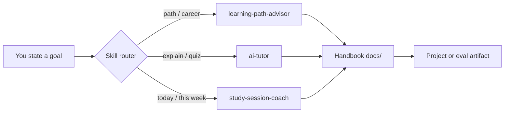

# Learn with Tutor Skills

The handbook is **large** — 16 core courses, 3 optional tracks, deep dives, projects,
and interview prep. You don't need to read linearly.

This repo includes **Claude Code / Cursor Agent Skills** that act as tutors: tell the
agent your goal, and it routes you to the right pages, plans your session, and teaches
from handbook content.

---

## Quick start

1. **Clone this repo** and open it in [Claude Code](https://docs.anthropic.com/en/docs/claude-code) or [Cursor](https://cursor.com).
2. **Skills load automatically** from `.claude/skills/` (see [Skills & Rules](../ai-engineering-2026/skills-and-rules.md)).
3. **State your goal in chat** — no special syntax required.

!!! example "Try these prompts"
    ```text
    I'm a backend engineer — I want to ship a RAG app in a month. Where do I start?

    Explain self-attention like I'm prepping for an interview.

    I have 90 minutes today. Coach my study session on agents.

    Quiz me on RAG chunking — I just read course 06 lesson 3.
    ```

---

## Learner & Tutor Skills

| Skill | You say… | You get… |
|-------|----------|----------|
| **repo-onboarding** | "What is this repo?" / "Show me around" / "Onboard me" | Complete interactive tour of repo structure, learning paths, labs, and skills |
| **learning-path-advisor** | "I want to learn …" / "Where should I start?" / "Help me get a job" | Multi-week path with exact `docs/` links, prerequisites, and a build project |
| **ai-tutor** | "Explain …" / "I don't understand …" / "Quiz me on …" | Socratic explanation grounded in handbook lessons + links to go deeper |
| **study-session-coach** | "I have 2 hours" / "Coach my session" / "Plan my week" | Time-boxed plan: which file to open, what artifact to produce, end-of-session check |
| **mock-interviewer** | "Interview me on RAG system design" | 45-minute whiteboard mock interview with follow-up questions & scoring |
| **lab-verifier** | "Review my lab code" / "Is my RAG code correct?" | Automated grading, code quality verification, and edge-case feedback |

Skills live in:

```text
.claude/skills/
  repo-onboarding/SKILL.md
  learning-path-advisor/SKILL.md
  ai-tutor/SKILL.md
  study-session-coach/SKILL.md
  mock-interviewer/SKILL.md
  lab-verifier/SKILL.md
  references/handbook-routing.md   ← shared routing index
```

---

## How routing works



Each skill **reads existing handbook files** before responding:

- `docs/start-here.md` — personas and goals
- `docs/learn/study-plans.md` — week-by-week schedules
- `docs/topic-map.md` — concept lookup
- Course `index.md` and `lessons/*.md` — exact next steps

The agent does **not** invent a parallel curriculum — it navigates what you already have.

---

## Pick the right skill

| Situation | Use |
|-----------|-----|
| Don't know where to begin | **learning-path-advisor** |
| Know the topic area, need schedule | **learning-path-advisor** → then **study-session-coach** |
| Reading a lesson, concept is fuzzy | **ai-tutor** (paste the lesson path if you can) |
| Finished a lesson, want retention | **ai-tutor** in quiz mode |
| Interview in 2 weeks | **learning-path-advisor** (interview goal) + **study-session-coach** (daily drills) |

---

## Example session flow

**Week 0 — plan**

> "I'm an ML engineer, new to agents, 6 hrs/week for 8 weeks."

→ **learning-path-advisor** returns the agent-engineer study plan with links to
[Agent Engineering](../agent-engineering/index.md) + courses 07–08.

**Week 1 — day 1**

> "Coach a 90-minute session starting at the agent loop."

→ **study-session-coach** assigns
[The Agent Loop](../agent-engineering/01-agent-loop.md) + artifact: implement the
minimal loop from the lesson.

**Week 1 — day 2 (stuck)**

> "Why does my agent loop never terminate?"

→ **ai-tutor** explains termination + links to
[Harness Engineering](../agent-engineering/04-harness-engineering.md).

---

## Study habits (built into the coach)

From [Study Plans](study-plans.md):

1. **One lesson → one artifact** — script, notebook, or eval case
2. **Teach it** — explain the concept aloud in 5 minutes after reading
3. **Use the glossary** — [Glossary](../glossary.md) when terms blur

Portfolio rule: ship **one RAG app**, **one agent**, **one production demo with evals**
— see [Build These First](../projects/build-these.md).

---

## Cursor vs Claude Code

Both load skills from `.claude/skills/` when this repo is open.

| Tool | Notes |
|------|-------|
| **Claude Code** | Reads root `CLAUDE.md` every session — points to tutor skills |
| **Cursor** | Agent Skills auto-discover from skill `description` field — see [Cursor Skills docs](https://cursor.com/docs/context/skills) |

Skill descriptions include **trigger phrases** ("Use when user wants to learn…") so the
agent picks the right tutor without you naming the skill file.

---

## Contributing tutor improvements

To improve routing or add trigger phrases, edit the skill's `SKILL.md` or
`.claude/references/handbook-routing.md`. Authoring conventions:
[Skills & Rules](../ai-engineering-2026/skills-and-rules.md) · [Contribute](../contribute.md)

**Next:** [Start Here](../start-here.md) · [Study Plans](study-plans.md) · [Topic Map](../topic-map.md)
