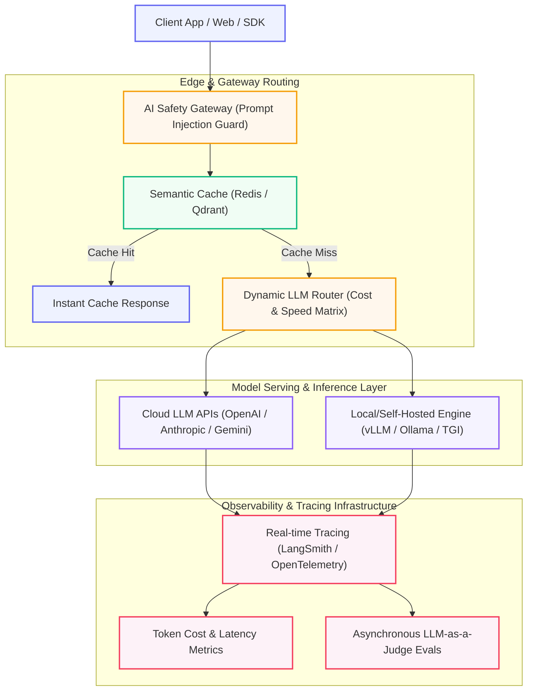

# 12. LLMOps & Production Systems

Deploy, serve, monitor, scale, and secure LLM applications in mission-critical enterprise environments.

  Course 12
  🔥 Advanced
  ⏱️ 10 lessons · ~16h

---

## 🛡️ Enterprise Production LLMOps System Topology

---

## 📚 Course Lessons

| # | Lesson Title | Duration | Level | Core Concept |
|---|--------------|----------|-------|--------------|
| 1 | [Introduction to LLMOps](lessons/01-Introduction-to-LLMOps.md) | 45 min | ⚡ Intermediate | LLMOps vs MLOps lifecycle, model context protocol, SLA design |
| 2 | [Observability & Monitoring](lessons/02-Observability-and-Monitoring.md) | 50 min | ⚡ Intermediate | Tracing spans, latency p99, token usage tracking, error budgets |
| 3 | [Prompt Versioning & Management](lessons/03-Prompt-Versioning.md) | 45 min | ⚡ Intermediate | Prompt registries, template versioning, CI/CD prompt integration |
| 4 | [Caching Strategies](lessons/04-Caching-Strategies.md) | 45 min | ⚡ Intermediate | Exact key caching vs semantic vector similarity caching |
| 5 | [A/B Testing for AI Applications](lessons/05-AB-Testing-for-AI.md) | 50 min | ⚡ Intermediate | Traffic splitting, prompt variant testing, human-in-the-loop comparison |
| 6 | [Cost Optimization](lessons/06-Cost-Optimization.md) | 50 min | ⚡ Intermediate | Model routing, context window pruning, batching, prompt compression |
| 7 | [Model Deployment Patterns](lessons/07-Model-Deployment.md) | 50 min | 🔥 Advanced | vLLM, TensorRT-LLM, Ollama, PagedAttention, continuous batching |
| 8 | [API Design for AI Services](lessons/08-API-Design.md) | 45 min | 🔥 Advanced | Streaming SSE (Server-Sent Events), WebSocket execution, async webhooks |
| 9 | [Security & Privacy](lessons/09-Security-and-Privacy.md) | 50 min | 🔥 Advanced | PII masking, data sanitization, jailbreak prevention, SOC2 compliance |
| 10 | [Scaling AI Applications](lessons/10-Scaling-AI-Apps.md) | 50 min | 🔥 Advanced | Load balancing, rate limiting, autoscaling GPU nodes, queue handling |

---

👉 **Get Started:** [Lesson 01 · Introduction to LLMOps](lessons/01-Introduction-to-LLMOps.md)
