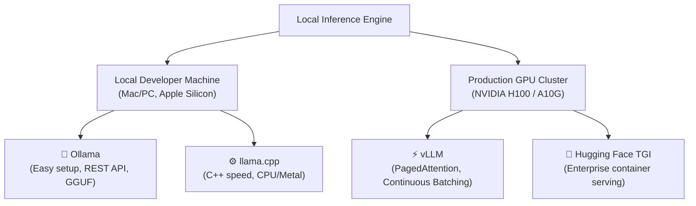

# Local LLM Inference and Serving (Ollama, vLLM)

## What You'll Learn

| Objective | Outcome |
|-----------|---------|
| Compare local inference engines (Ollama vs vLLM vs llama.cpp) | Select the right tool for local dev vs production clusters |
| Run open-source models locally using Ollama API | Integrate local models with zero API cost |
| Deploy high-throughput production serving with vLLM PagedAttention | Maximize throughput and token generation per second |

---

## Why Local Inference Matters in 2026

1. **Zero API Cost & Unlimited Iteration**: Run dev/test pipelines without credit limits.
2. **Data Privacy & Compliance**: Sensitive medical, financial, or private code stays on-premise.
3. **Low Latency & Offline Capability**: No WAN network roundtrips.

---

## Local Serving Engine Landscape



---

## 1. Quick Start: Ollama Python API Integration

Ollama runs GGUF quantized models locally and exposes an OpenAI-compatible endpoint.

```bash
# Terminal setup:
ollama pull llama3.2:3b
```

```python
from openai import OpenAI

# Point OpenAI client to local Ollama server (http://localhost:11434/v1)
client = OpenAI(
    base_url="http://localhost:11434/v1",
    api_key="ollama",  # API key is not required for local Ollama
)

response = client.chat.completions.create(
    model="llama3.2:3b",
    messages=[
        {"role": "system", "content": "You are a helpful assistant running locally."},
        {"role": "user", "content": "Explain how PagedAttention speeds up vLLM."},
    ],
    temperature=0.2,
)

print(response.choices[0].message.content)
```

---

## 2. High-Throughput Production Serving with vLLM

vLLM uses **PagedAttention** to eliminate memory fragmentation in the KV Cache, achieving 2-4x higher throughput than standard Hugging Face pipelines.

### Running vLLM Server via CLI

```bash
# Start OpenAI-compatible vLLM server on GPU
vllm serve meta-llama/Llama-3.1-8B-Instruct \
    --port 8000 \
    --tensor-parallel-size 1 \
    --max-model-len 4096
```

### Direct Python Offline Batch Inference with vLLM

```python
from vllm import LLM, SamplingParams

prompts = [
    "Explain vector database indexing in 2 sentences.",
    "What is the role of continuous batching in vLLM?",
    "Summarize ReAct agent loops for production.",
]

sampling_params = SamplingParams(temperature=0.7, max_tokens=150)

# Load model onto GPU using vLLM engine
llm = LLM(model="meta-llama/Llama-3.1-8B-Instruct", tensor_parallel_size=1)

outputs = llm.generate(prompts, sampling_params)

for output in outputs:
    prompt = output.prompt
    generated_text = output.outputs[0].text
    print(f"\nPrompt: {prompt}\nGenerated: {generated_text}")
```

---

## Throughput & Cost Trade-off Matrix

| Engine | Latency per Token | Throughput (req/sec) | Setup Complexity | Hardware Needed |
|--------|-------------------|----------------------|------------------|-----------------|
| **Ollama** | Fast (Metal/CPU) | Low (Single-user) | Single command | Mac / Consumer GPU |
| **vLLM** | Ultra-Fast | Extremely High (Concurrent) | Medium (Python/CUDA) | NVIDIA GPU |
| **OpenAI API** | Variable (Network) | Unlimited | API Key only | Cloud API |

---


!!! note "Key Intuition & Mental Model"
    When building production AI systems, isolate model calls behind clean abstraction interfaces. Always design for fallback models, rate limit retries, and strict schema validation.


## Key Takeaways

- Use **Ollama** for rapid local prototyping with zero cloud cost.
- Deploy **vLLM** in production GPU clusters when high concurrent throughput and PagedAttention memory optimization are required.


## Further Reading & Primary References

1. [Attention Is All You Need (Vaswani et al. 2017)](https://arxiv.org/abs/1706.03762)
2. [Retrieval-Augmented Generation for Knowledge-Intensive NLP Tasks (Lewis et al. 2020)](https://arxiv.org/abs/2005.11401)
3. [ReAct: Synergizing Reasoning and Acting in Language Models (Yao et al. 2022)](https://arxiv.org/abs/2210.03629)
