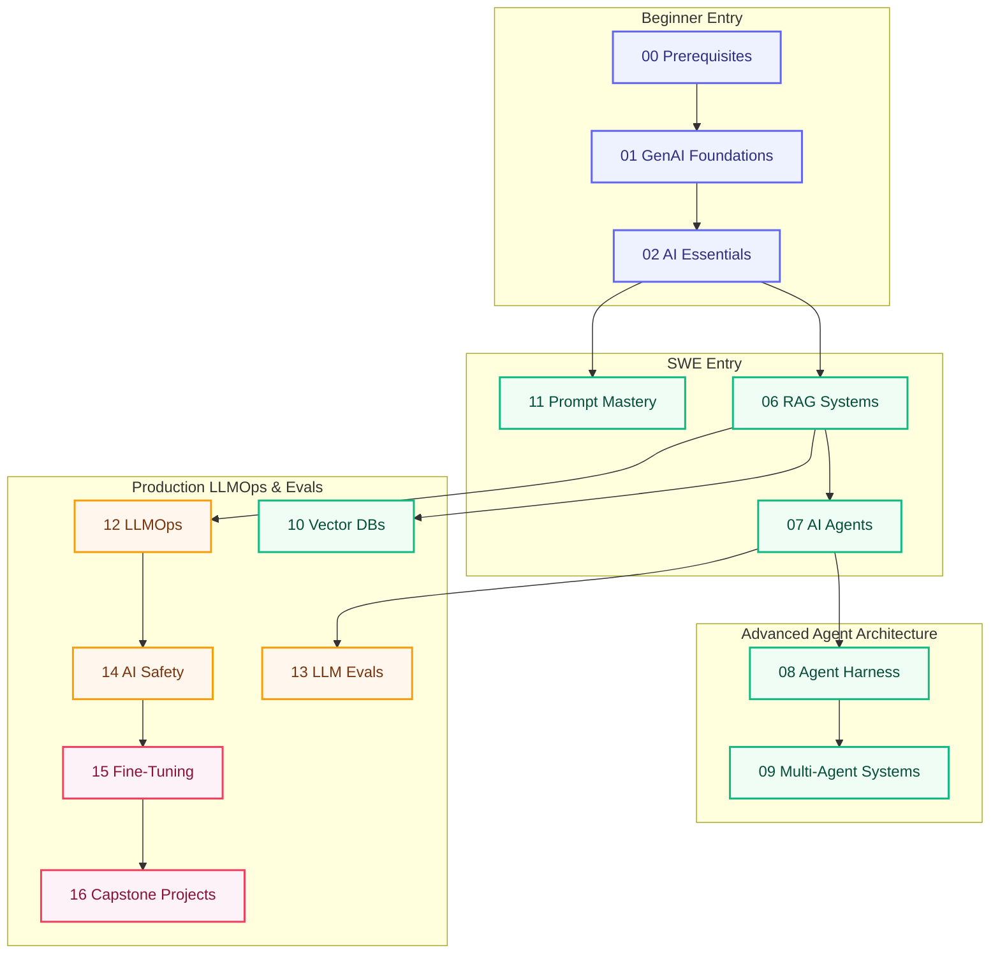

# Start Here

**One page to route every learner.** Pick your background, follow the sequential path in the **Learn** tab, and build something real.

!!! tip "How the site works"
    Open **Learn** in the top nav — 16 courses in order (01–16). Each course page lists its lessons. No module codes in the UI.

!!! tip "Quick setup"
    Need install commands only? See [Getting Started](getting-started.md#local-setup).

!!! tip "Learning in Claude Code or Cursor?"
    Clone this repo and **state your goal in chat** — tutor skills in `.claude/skills/` route
    you through the handbook (paths, sessions, explanations). See
    **[Learn with Tutor Skills](learn/using-tutor-skills.md)**.

---

## 🎯 Choose Your Pathway

  

    
🌱

    
Complete Beginner

    
No prior CS background or Python experience. Start with math, tokenization, and fundamental scripts.

    <a class="persona-card__cta" href="foundations/module-00-genai-foundations-from-nlp-to-transformers/lessons/01-prerequisites.html">Start Prerequisites →</a>
  

  

    
💻

    
Software Engineer

    
Comfortable in Python / TS. Learn LLM APIs, function calling, RAG, and agent loops.

    <a class="persona-card__cta" href="foundations/module-01-ai-engineering-essentials/">AI Essentials (02) →</a>
  

  

    
🧠

    
ML Engineer

    
Know PyTorch and backprop. Jump into transformers, LLM serving, and fine-tuning.

    <a class="persona-card__cta" href="foundations/module-07-large-language-models-llms/">LLM Deep Dive (05) →</a>
  

  

    
🚀

    
Agent Architect

    
Ship autonomous loops, MCP servers, sandboxed tool runtimes, and multi-agent systems.

    <a class="persona-card__cta" href="agent-engineering/">Agent Track →</a>
  

---

## I want to learn…

### By Goal

| I want to… | Read first | Then | Build |
|------------|------------|------|-------|
| **Understand how LLMs work** | [01 GenAI](foundations/module-00-genai-foundations-from-nlp-to-transformers/index.md) → [04 Transformers](foundations/module-06-transformers-attention-mechanisms/index.md) → [05 LLMs](foundations/module-07-large-language-models-llms/index.md) | [Deep Dives](deep-dives/index.md) | [Course 04 exercises](foundations/module-06-transformers-attention-mechanisms/exercises/index.md) |
| **Call LLM APIs in production** | [02 AI Essentials](foundations/module-01-ai-engineering-essentials/index.md) | [12 LLMOps](production/module-10-llmops-production-systems/index.md) | [Project 1: Doc Q&A bot](projects/build-these.md#1-doc-qa-bot-rag-starter) |
| **Build RAG over my documents** | [06 RAG](build/module-09-rag-retrieval-augmented-generation/index.md) | [10 Vector DBs](build/module-13-vector-databases-deep-dive/index.md) | [Project 2: Enterprise RAG](projects/build-these.md#2-enterprise-rag-with-citations) |
| **Build AI agents** | [Agent Engineering track](agent-engineering/index.md) or [07 AI Agents](build/module-11-ai-agents-fundamentals/index.md) | [08 Agent Harness](build/module-18-agent-harness-tools-runtime/index.md) | [Project 4: Tool-using agent](projects/build-these.md#4-tool-using-research-agent) |
| **Ship multi-agent systems** | [09 Multi-Agent Systems](build/module-12-multi-agent-systems/index.md) | [13 LLM Evals](production/module-19-llm-evaluation-quality/index.md) | [Project 5: Multi-agent research](projects/build-these.md#5-multi-agent-research-system) |
| **Fine-tune a model** | [15 Fine-Tuning](advanced/module-15-fine-tuning-custom-models/index.md) | [05 LLMs](foundations/module-07-large-language-models-llms/index.md) | [Project 8: Domain fine-tune](projects/build-these.md#8-domain-style-fine-tune) |
| **Evaluate & monitor LLM apps** | [13 LLM Evaluation](production/module-19-llm-evaluation-quality/index.md) | [Evals hub](evals-observability/index.md) | [Project 9: Eval suite](projects/build-these.md#9-ai-quality-eval-suite) |
| **Use Claude Code / IDE skills** | [Modern AI (2026)](ai-engineering-2026/index.md) | [Skills & Rules](ai-engineering-2026/skills-and-rules.md) | Custom skill for your repo |

---

## 🔗 Prerequisite & Dependency Map

| Course | Requires | Self-Check |
|--------|----------|------------|
| **01 GenAI Foundations** | Python basics, comfort with math | Can you write a Python function and handle lists/dicts? |
| **02 AI Essentials** | Course 01 or SWE background | Can you call a REST API or SDK in Python? |
| **03–04 Neural Nets & Transformers** | Course 01 math, NumPy | Can you explain matrix multiplication and softmax? |
| **05 LLMs** | Course 04 | Can you sketch self-attention and transformer blocks? |
| **06 RAG** | Course 02 (APIs) + embeddings | Can you chunk text and call an embedding API? |
| **07 AI Agents** | Course 02 + Course 06 | Can you explain retrieve-then-generate? |
| **08 Agent Harness** | Course 07 agent loop | Can you implement a basic ReAct loop? |
| **09 Multi-Agent** | Courses 07 + 08 | Can you trace state passing between two agents? |
| **15 Fine-Tuning** | Course 05 fine-tuning basics | Do you know LoRA vs full parameter fine-tuning? |
| **16 Capstones** | Courses 06 + 07 minimum | Have you built at least one RAG and one agent app? |

---

## Your first 4 weeks (career switcher roadmap)

??? info "Expand 4-week career switcher plan"

    | Week | Focus | Courses | Milestone |
    |------|-------|---------|-----------|
    | **1** | Python + first API call | 01 (prerequisites), 02 | Working chat script + token cost log |
    | **2** | Prompts + RAG basics | 02 exercises, 06 lessons 1–5 | Doc Q&A over 10 PDFs |
    | **3** | Agents + harness | 07 lessons 1–7, 08 lessons 1–3 | Agent with 2 tools |
    | **4** | Evals + portfolio polish | 13 lessons 1–3, [Build These](projects/build-these.md) | One project on GitHub with README |

    After week 4: continue the [Learn path](learn/index.md) through production (12–14) and advanced (15–16).

---

## Practice: exercises & projects

| Resource | What it is | Link |
|----------|------------|------|
| **Exercises** | Starter/solution `.py` files per course | [Exercise index](exercises/index.md) |
| **Build These First** | 10 portfolio projects mapped to courses | [build-these.md](projects/build-these.md) |
| **Capstones** | Full production briefs (course 16) | [Capstone projects](advanced/module-17-capstone-projects/index.md) |

---

## When to use RAG vs fine-tune vs agents

Quick decision guide — full tables in [FAQ](faq.md#rag-vs-fine-tuning-vs-agents).

| Need | Use | Avoid |
|------|-----|-------|
| Answer from **your documents** | **RAG** | Fine-tuning for facts |
| **Consistent format/style** every time | **Fine-tune** or strict prompts | Hoping RAG fixes tone |
| **Multi-step tasks** with tools | **Agent** | Long deterministic workflow pretending to be an agent |
| **Deterministic pipeline** (ETL, approvals) | **Workflow** | Autonomous agent |
| **Cheapest first attempt** | Prompt engineering | Fine-tune on day one |

---

## Stuck? Read this

| Problem | Go to |
|---------|-------|
| Don't know where to start | This page — pick a persona above |
| Lesson assumes math I don't have | [01 · Math foundations](foundations/module-00-genai-foundations-from-nlp-to-transformers/lessons/02-math-foundations.md) |
| API key / rate limit errors | [FAQ — Troubleshooting](faq.md#troubleshooting) |
| Term I don't understand | [Glossary](glossary.md) |
| Want a portfolio project | [Build These First](projects/build-these.md) |
| Content gap or bug | [Contribute](contribute.md) · [GitHub Issues](https://github.com/psssnikhil/ai-engineering-hub/issues) |

---

## Site map

| Tab / page | Purpose |
|------------|---------|
| **Start Here** (this page) | Persona routing, prerequisites, goals |
| **[Learn](learn/index.md)** | Sequential courses 01–16 + optional tracks |
| **[Study Plans](learn/study-plans.md)** | Week-by-week schedules by persona |
| **[Topic Map](topic-map.md)** | Concept → course lookup |
| **[Reference](faq.md)** | FAQ, glossary, deep dives, resources |
| **[Projects](projects/build-these.md)** | Portfolio builds |
