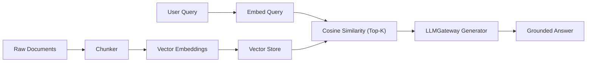

# Project 01: RAG Pipeline from Scratch

A zero-dependency reference implementation of a complete RAG (Retrieval-Augmented Generation) pipeline: chunking, dense vector retrieval, cosine similarity search, and grounded LLM generation via standard `LLMGateway`.



## Quick Example Code

```python
from main import RAGPipeline

DOCUMENTS = [
    "RAG stands for Retrieval-Augmented Generation.",
    "Vector databases store dense embeddings for fast similarity search.",
    "Chunking splits documents into smaller pieces for retrieval."
]

pipeline = RAGPipeline()
pipeline.index(DOCUMENTS)

answer = pipeline.query("What is RAG?")
print(answer)
```

## Quickstart

```bash
python main.py
```
