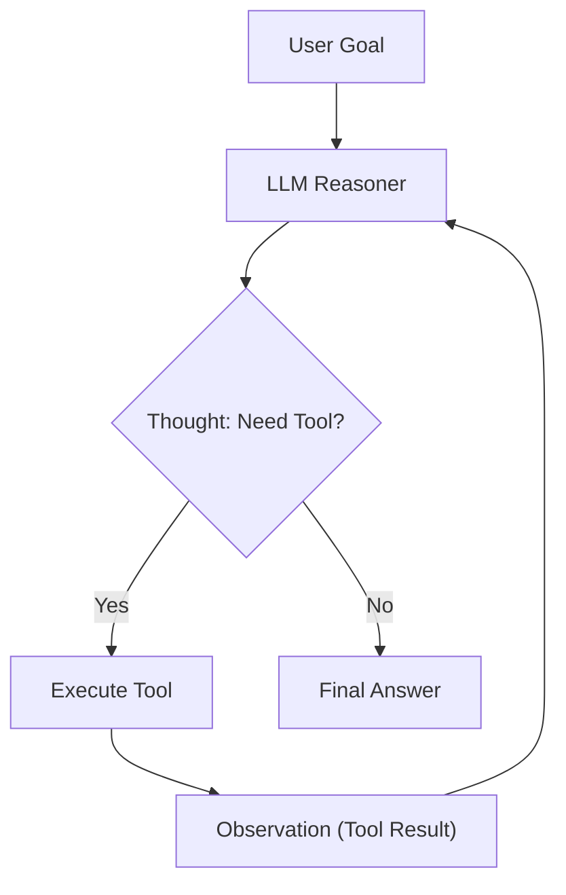

# Project 02: ReAct Agent Loop from Scratch

An autonomous ReAct (Reasoning + Acting) agent loop implementation with tool parsing, multi-provider LLM gateway integration, and tool execution observation loops.



## Quick Example Code

```python
from main import ReActAgent, calculator_tool, search_tool

tools = [calculator_tool, search_tool]
agent = ReActAgent(tools=tools, max_steps=5)

response = agent.run("Calculate 42 * 17 and search for AI Engineering trends.")
print(response)
```

## Quickstart

```bash
python main.py
```
