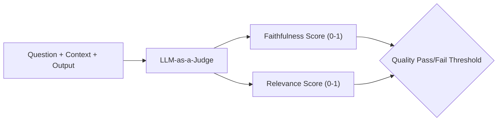

# Project 03: LLM Evaluation Harness from Scratch

An LLM-as-a-Judge evaluation framework for faithfulness, context relevance, and output quality scoring suitable for automated CI quality gates.



## Quick Example Code

```python
from main import LLMEvaluator

evaluator = LLMEvaluator()

score = evaluator.evaluate(
    question="What is RAG?",
    context="RAG stands for Retrieval-Augmented Generation.",
    answer="RAG is Retrieval-Augmented Generation [1]."
)
print(f"Faithfulness Score: {score.faithfulness}")
```

## Quickstart

```bash
python main.py
```
