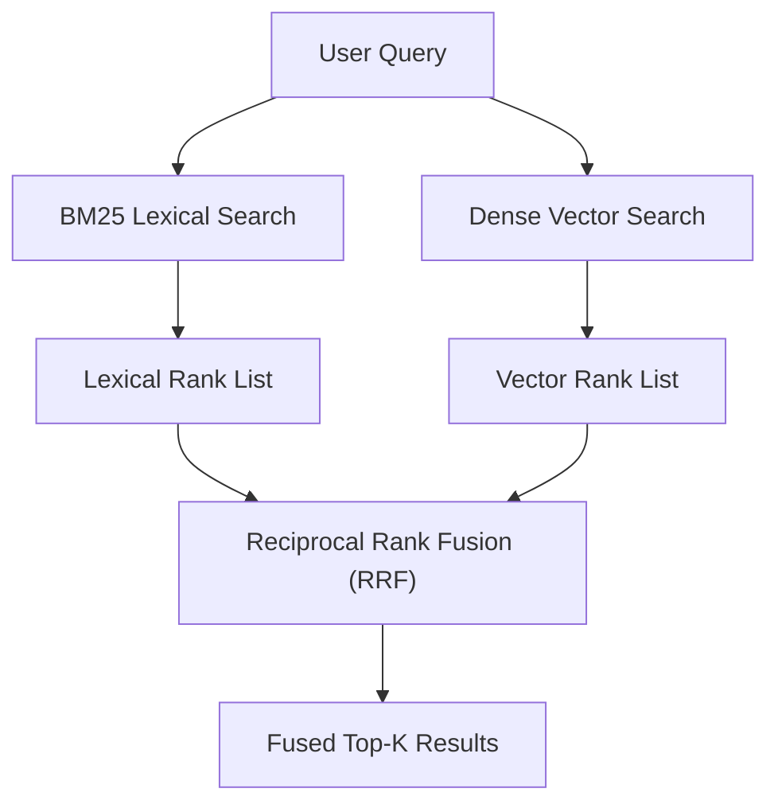

# Project 04: Hybrid Search & Reciprocal Rank Fusion (RRF)

A hybrid retrieval engine combining lexical BM25 term frequency matching with dense vector embeddings, fused seamlessly using Reciprocal Rank Fusion (RRF).



## Quick Example Code

```python
from main import HybridSearchEngine

engine = HybridSearchEngine()
engine.index([
    "Python is a popular programming language.",
    "BM25 handles exact keyword frequency matching.",
    "Vector embeddings capture deep semantic meaning."
])

results = engine.search("keyword matching in BM25", top_k=2)
for doc, score in results:
    print(f"[{score:.4f}] {doc}")
```

## Quickstart

```bash
python main.py
```
