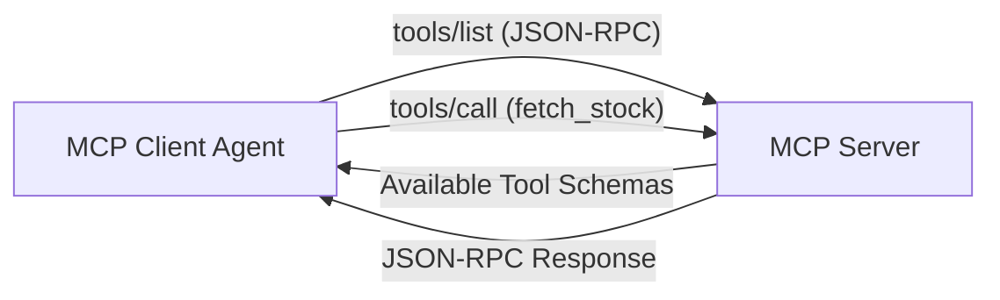

# Project 05: Model Context Protocol (MCP) Agent Integration

An end-to-end Model Context Protocol (MCP) reference implementation featuring an in-memory JSON-RPC 2.0 MCP server, capability discovery, tool schemas, and an MCP client agent loop.



## Quick Example Code

```python
from main import MCPServer, MCPClient

server = MCPServer()
client = MCPClient(server)

# Discover tools over JSON-RPC 2.0 protocol
tools = client.list_tools()
print("Discovered MCP Tools:", [t["name"] for t in tools])

# Execute tool call
result = client.call_tool("calculator", {"expression": "25 * 4"})
print("Result:", result)
```

## Quickstart

```bash
python main.py
```
