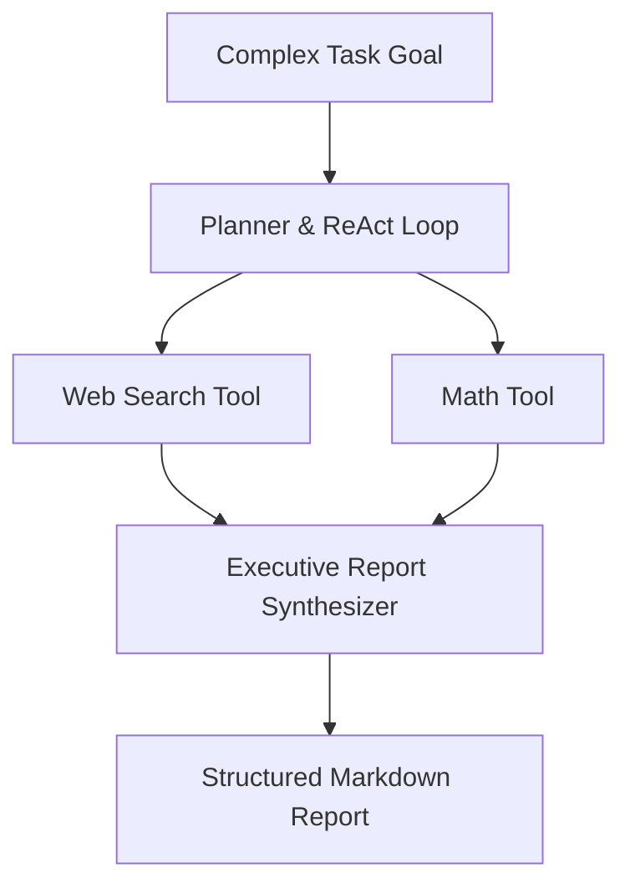

# Reference Project: Autonomous Agent Platform

An autonomous ReAct research agent platform with multi-step goal decomposition, standardized multi-provider LLM gateways (OpenAI + Anthropic), tool execution, and executive markdown report synthesis.



## Quick Example Code

```python
from agent import AutonomousAgent

agent = AutonomousAgent(max_steps=6)
report = agent.run("Research market trends in AI Agents for 2026.")
print(report)
```

## Quickstart

```bash
python main.py
```
