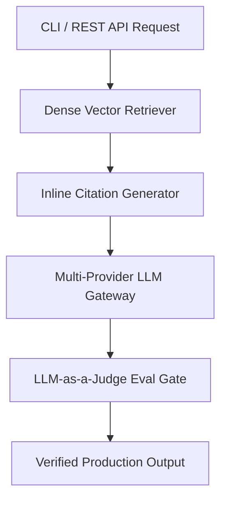

# Reference Project: Enterprise RAG Assistant

A complete, production-grade Enterprise RAG application with dense vector indexing, multi-provider LLM gateways (OpenAI + Anthropic fallback), inline document citations, and automated LLM-as-a-Judge quality evaluation.



## Quick Example Code

```python
from retriever import DenseVectorStore

store = DenseVectorStore()
store.add_documents([
    "Production RAG requires deterministic chunking and metadata filtering.",
    "Automated LLM-as-a-Judge evaluation ensures low hallucination rates."
])

results = store.search("What is required for production RAG?", top_k=2)
print("Top Document:", results[0]["text"])
```

## Quickstart

```bash
# Run CLI mode
python main.py

# Run REST API mode
python main.py --serve
```
