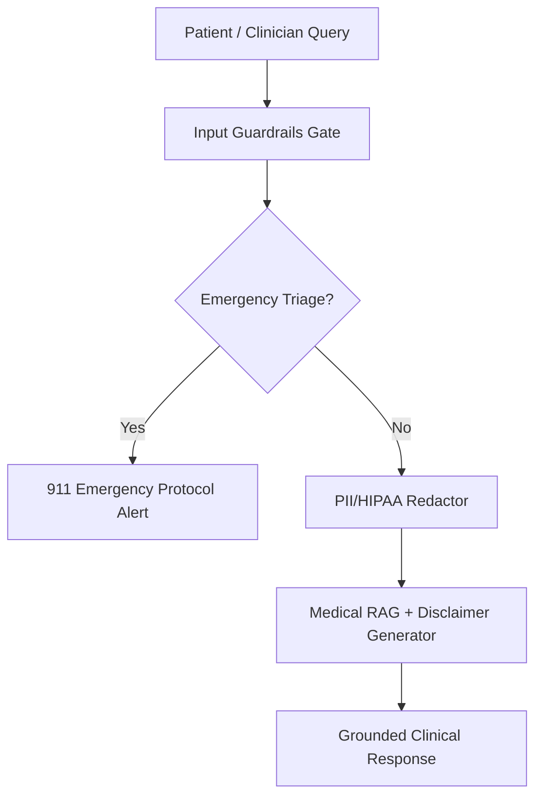

# Project 09: Healthcare Medical Guardrails Agent

A clinical decision support agent featuring multi-layer safety guardrails: emergency triage classifier, medical disclaimer enforcement, PII/HIPAA redactor, and grounded medical RAG.



## Quick Example Code

```python
from main import HealthcareAgent

agent = HealthcareAgent()
response = agent.handle_query("Patient shows signs of severe chest pain and dizziness.")
print(response)
```

## Quickstart

```bash
python main.py
```
