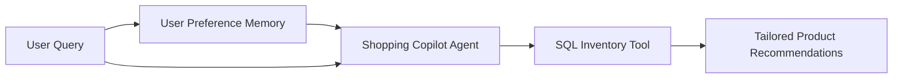

# Project 10: E-Commerce AI Shopping Copilot

A personalized e-commerce shopping copilot featuring long-term user preference memory, SQL inventory search tools, and structured product recommendation generation.



## Quick Example Code

```python
from main import ShoppingCopilot

copilot = ShoppingCopilot(user_id="usr_7712")
recommendations = copilot.recommend("I need a lightweight noise-canceling headphone under $200.")
print(recommendations)
```

## Quickstart

```bash
python main.py
```
