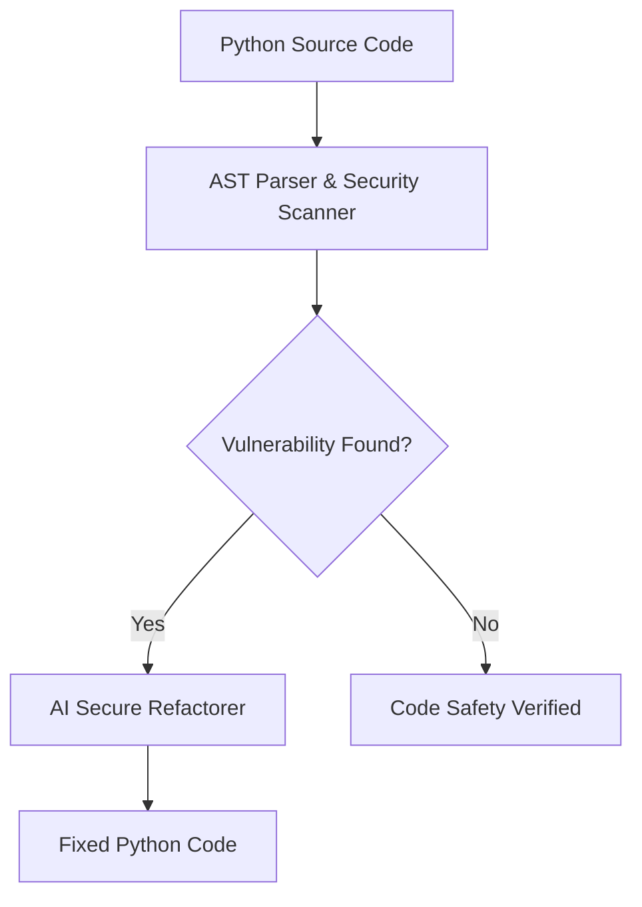

# Project 11: Code Analysis & IDE Assistant

A developer coding assistant featuring Python AST parsing, static security vulnerability detection (SQL injection risk), and automated secure refactoring.



## Quick Example Code

```python
from main import CodeAnalysisAssistant

assistant = CodeAnalysisAssistant()
vulnerabilities = assistant.scan_code("query = f'SELECT * FROM users WHERE id = {user_id}'")
print("Vulnerabilities Detected:", vulnerabilities)
```

## Quickstart

```bash
python main.py
```
