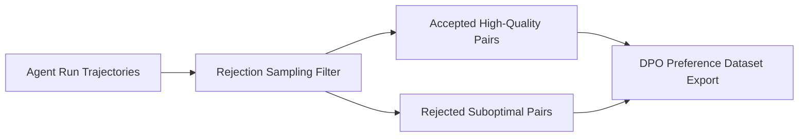

# Project 12: Agent Data Flywheel & Trajectory Curator

An automated synthetic data flywheel and trajectory curator featuring rejection sampling filters and DPO/ORPO preference dataset generation for model fine-tuning and alignment.



## Quick Example Code

```python
from main import DataFlywheelCurator

curator = DataFlywheelCurator()
dataset = curator.curate_trajectories(sample_count=10)
print(f"Curated {len(dataset)} DPO alignment pairs.")
```

## Quickstart

```bash
python main.py
```
